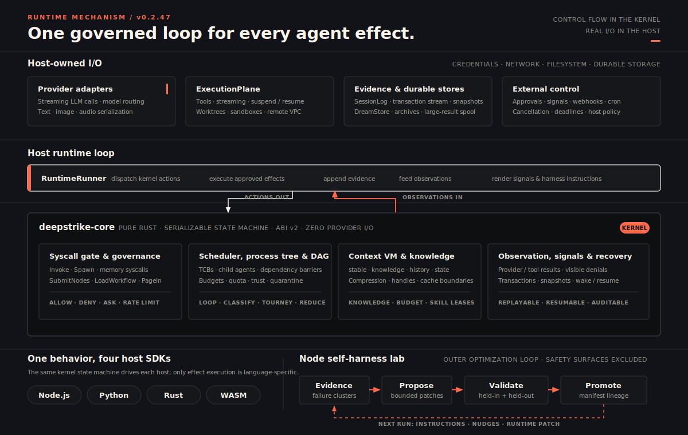

<p align="center">
  <a href="https://github.com/kongusen/deepstrike">
    
  </a>
</p>

<h1 align="center">DeepStrike</h1>

<p align="center">
  <strong>An Agent OS microkernel for dynamic workflows, governed tools, replayable sessions, and cross-language agent runtimes.</strong>
</p>

<p align="center">
  <a href="https://github.com/kongusen/deepstrike/releases"></a>
  <a href="https://www.npmjs.com/package/@deepstrike/sdk"></a>
  <a href="https://pypi.org/project/deepstrike/"></a>
  <a href="https://crates.io/crates/deepstrike-sdk"></a>
  <a href="https://www.anthropic.com/claude"></a>
  <a href="https://discord.gg/cwS3RBYCv"></a>
  <a href="./LICENSE"></a>
</p>

<p align="center">
  <strong>English</strong>
  · <a href="./README.zh-CN.md">中文</a>
</p>

<p align="center">
  <a href="./docs/en/index.md">Documentation</a>
  · <a href="./docs/en/getting-started/hello-agent.md">Hello Agent</a>
  · <a href="./docs/en/architecture/agent-os.md">Agent OS</a>
  · <a href="./docs/en/guides/workflow.md">Dynamic Workflows</a>
  · <a href="https://discord.gg/cwS3RBYCv">Discord</a>
</p>

---

DeepStrike turns an agent "harness" into a kernel primitive.

Modern agents increasingly solve hard tasks by writing a small workflow: classify the work, fan out to sub-agents, verify outputs, loop until done, and synthesize a final answer. In a script, that harness is powerful but fragile: state lives in process memory, governance is ad hoc, recovery is hard, and every language has to reimplement the same semantics.

DeepStrike moves the control plane into `deepstrike-core`, a pure Rust state machine. Host SDKs still own all real I/O: LLM calls, tools, files, worktrees, network, long-term memory, and storage. The kernel decides when and whether effects may happen; the host executes approved effects and feeds observations back.

<p align="center">
  
</p>

## What You Get

| Capability | What DeepStrike provides |
| :--- | :--- |
| **Dynamic workflow scheduler** | Declarative DAGs plus runtime `SubmitNodes`; first-class `Loop`, `Classify`, `Tournament`, `Reduce`, fan-out, synthesize, generate-filter, and verifier patterns. |
| **Unified syscall governance** | Tool calls, sub-agent spawn, workflow growth, and memory writes pass one gate with allow / deny / ask-user / rate-limit / quota dispositions. |
| **Context VM** | Four-slot rendering (`system_stable`, `system_knowledge`, `turns`, `state_turn`), pressure compression, handle paging for large tool results, prompt-cache-aware stable prefixes, and a governed knowledge lifecycle (keyed entries, boundary-deferred eviction, knowledge budget, skill leases). |
| **Sub-agent isolation** | Roles, context inheritance, capability filters, worktree / read-only / remote isolation, process lineage, contracts, and handoff artifacts. |
| **Replay and recovery** | Append-only `SessionLog`, provider replay envelopes, kernel observations, workflow resume, `wake(session_id)`, OS snapshots, and repair utilities. |
| **Memory as an OS device** | Kernel-validated `write_memory` / `query_memory`, DreamStore integration, retrieval closure, idle consolidation, and memory write quotas. |
| **Provider routing** | Kernel carries `model_hint`; the host resolves it to OpenAI, Anthropic, Gemini, DeepSeek, Kimi, Qwen, GLM, Minimax, Ollama, or your own provider. |
| **Multimodal input** | Image and audio via `run({ attachments })` across all four SDKs, per-vendor serialization (Anthropic blocks, OpenAI `image_url` / `input_audio`, Gemini `inlineData`), detail-weighted token accounting, and `UnsupportedModalityError` instead of silent drops. |
| **Cross-language runtime** | One kernel ABI and matching semantics across Node.js, Python, Rust, and WASM. |

## Why a Kernel?

The Agent OS split is deliberately narrow:

```text
LLM emits a plan or tool request
        |
        v
deepstrike-core decides: schedule, gate, budget, compress, snapshot
        |
        v
Host SDK executes: provider, tools, files, worktrees, stores, webhooks
        |
        v
Observations return to the kernel and SessionLog
```

That boundary gives you properties a one-off orchestrator script does not:

| Property | Script harness | DeepStrike kernel |
| :--- | :--- | :--- |
| Replay | State is usually closure variables or temporary files | Control-flow observations and snapshots rebuild the run |
| Governance | Each tool path implements checks differently | One syscall gate covers tools, spawn, memory, and workflow append |
| Recovery | Interruptions often restart the harness | SessionLog + `KernelSnapshot` restore suspended workflows |
| Cross-language | Semantics drift across SDKs | Rust kernel drives every host |
| I/O ownership | Control flow and credentials mix together | Kernel is pure compute; host owns credentials and side effects |

## Runtime Layers

| Layer | Owns | Does not own |
| :--- | :--- | :--- |
| **Kernel (`deepstrike-core`)** | State machine, scheduling, syscall disposition, governance, workflow DAGs, budget ledger, context rendering, memory validation, observations | HTTP, filesystem, provider clients, vector stores, subprocesses |
| **Host SDK** | Runtime loop, provider calls, tool execution, session persistence, DreamStore, archive store, worktree and sandbox integration | Reimplementing spawn gates or workflow semantics |
| **Provider** | Vendor protocol adaptation, streaming, replay envelopes, model-specific runtime policy | Policy decisions |
| **ExecutionPlane** | Local tools, streaming tools, suspend/resume, worktree cwd injection, process sandbox, remote VPC tools, large result spool | Context compression |

## Install

| Runtime | Package | Install |
| :--- | :--- | :--- |
| Node.js / TypeScript | `@deepstrike/sdk` | `npm install @deepstrike/sdk` |
| Python | `deepstrike` | `pip install deepstrike` |
| Rust | `deepstrike-sdk` | `cargo add deepstrike-sdk` |
| Browser / Edge / WASM | `@deepstrike/wasm` | `npm install @deepstrike/wasm` |

Current SDK version in this workspace: `0.2.42`.

## Quick Start

### Node.js / TypeScript

```bash
npm install @deepstrike/sdk
```

```ts
import { OpenAIProvider, runAgent, runFanout, tool } from "@deepstrike/sdk"

const add = tool("add", "Add two numbers.", {
  type: "object",
  properties: { x: { type: "number" }, y: { type: "number" } },
  required: ["x", "y"],
}, async ({ x, y }) => String(Number(x) + Number(y)))

const provider = new OpenAIProvider({
  apiKey: process.env.OPENAI_API_KEY!,
  model: "gpt-4.1-mini",
})

const answer = await runAgent({
  provider,
  goal: "What is 17 + 28?",
  tools: [add],
})

const { synthesis } = await runFanout({
  provider,
  tasks: [
    "Summarize the auth module's risk profile.",
    "Summarize the data layer's risk profile.",
  ],
  synthesize: "Combine the findings into one concise review.",
})
```

Use `runAgent` for the simple path, `runFanout` for a kernel-gated workflow from a stateless handler, and `RuntimeRunner` when you need streaming events, SessionLog persistence, tools, governance, signals, memory, or explicit workflow control.

### Python

```bash
pip install deepstrike
```

```py
from deepstrike import OpenAIProvider, run_agent, run_fanout, tool

@tool
async def add(x: int, y: int) -> str:
    """Add two numbers."""
    return str(x + y)

provider = OpenAIProvider(api_key="sk-...", model="gpt-4.1-mini")

answer = await run_agent(
    provider=provider,
    goal="What is 17 + 28?",
    tools=[add],
)

out = await run_fanout(
    provider=provider,
    tasks=[
        "Summarize the auth module's risk profile.",
        "Summarize the data layer's risk profile.",
    ],
    synthesize="Combine the findings into one concise review.",
)
synthesis = out["synthesis"]
```

### Rust

```toml
[dependencies]
deepstrike-sdk = "0.2.41"
```

### WASM

```bash
npm install @deepstrike/wasm
```

See the per-runtime READMEs for full examples: [Node.js](./node/README.md), [Python](./python/README.md), [Rust](./rust/README.md), [WASM](./wasm/README.md).

## Dynamic Workflow Patterns

DeepStrike implements the common harness patterns as first-class workflow nodes rather than prompt-only conventions.

| Pattern | Kernel / SDK surface |
| :--- | :--- |
| Classify and act | `classify` node selects one branch and prunes the rest |
| Fan out and synthesize | `runFanout` / `fanout_synthesize`: N workers plus synthesis barrier |
| Adversarial verification | `verify_rules`: one fresh-context verifier per rule |
| Generate and filter | `generate_and_filter`: parallel generators plus verifier barrier |
| Tournament | `tournament` node with pairwise judging |
| Loop until done | `loop` node with `loop_continue`, `max_iters`, and runtime `SubmitNodes` |
| Deterministic compute | `Reduce` node with reducers such as `concat`, `dedupe_lines`, `merge_json_arrays`, and `count` |

Read the workflow guide: [Dynamic Workflows](./docs/en/guides/workflow.md).

## Documentation

| Reader path | Start here |
| :--- | :--- |
| New users | [Hello Agent](./docs/en/getting-started/hello-agent.md) and [Choosing an API](./docs/en/getting-started/run-agent-vs-runner.md) |
| Runtime designers | [What is Agent OS?](./docs/en/architecture/agent-os.md), [Kernel / SDK Split](./docs/en/architecture/overview.md), [Execution Model](./docs/en/architecture/execution-model.md) |
| Workflow builders | [Dynamic Workflows](./docs/en/guides/workflow.md), [Sub-Agents & Collaboration](./docs/en/guides/sub-agents-and-collaboration.md), [Structured Output & Reducers](./docs/en/guides/structured-output-and-reducers.md) |
| Production integrators | [Execution Plane & Tools](./docs/en/guides/execution-plane-and-tools.md), [Governance](./docs/en/guides/governance.md), [Provider Routing](./docs/en/guides/provider-routing.md) |
| Long-context agents | [Context Engineering](./docs/en/guides/context-engineering.md), [Memory](./docs/en/guides/memory.md), [Prompt Cache Design](./docs/en/concepts/prompt-cache-design.md) |
| Replay and operations | [Session, Replay & Recovery](./docs/en/guides/session-replay-and-recovery.md), [OS Profile & Runtime Snapshots](./docs/en/guides/os-profile-and-snapshots.md), [Signals & Reactive](./docs/en/guides/signals-and-reactive.md) |
| Reference | [RuntimeOptions](./docs/en/reference/runtime-options.md), [WorkflowNodeSpec](./docs/en/reference/workflow-node-spec.md), [Python API](./docs/en/reference/python-api.md), [Kernel ABI](./docs/en/architecture/kernel-abi.md) |

Run the docs locally:

```bash
npm install
npm run docs:dev
npm run docs:build
```

## Repository Layout

```text
crates/deepstrike-core/   Pure Rust kernel state machine
crates/deepstrike-node/   Node.js native bindings
crates/deepstrike-py/     Python native bindings
crates/deepstrike-wasm/   WASM bindings
node/                     TypeScript host SDK
python/                   Python host SDK
rust/                     Rust host SDK
wasm/                     Browser and edge SDK
docs/                     VitePress documentation source
tests/                    Cross-language integration tests
scripts/                  Release and verification automation
```

## Local Development

Requirements: Rust 1.85+ · Node.js 18+ · Python 3.10+

```bash
cargo build && cargo test
```

```bash
cd node && npm install && npm run build && npm test
```

```bash
cd python && python3 -m venv .venv && source .venv/bin/activate
pip install maturin pytest pytest-asyncio && maturin develop --release && pytest
```

```bash
cd wasm && npm install && npm run build && npm test
```

## Community

- Join the developer community on [Discord](https://discord.gg/cwS3RBYCv).
- Report issues or request features in [GitHub Issues](https://github.com/kongusen/deepstrike/issues).
- Read [CONTRIBUTING.md](./CONTRIBUTING.md) before opening a pull request.
- Report security issues through the process in [SECURITY.md](./SECURITY.md).

## License

DeepStrike is released under the [MIT License](./LICENSE). DeepStrike is an independent open-source project inspired by published work on dynamic workflows in agent coding tools; it is not affiliated with or endorsed by Anthropic.
