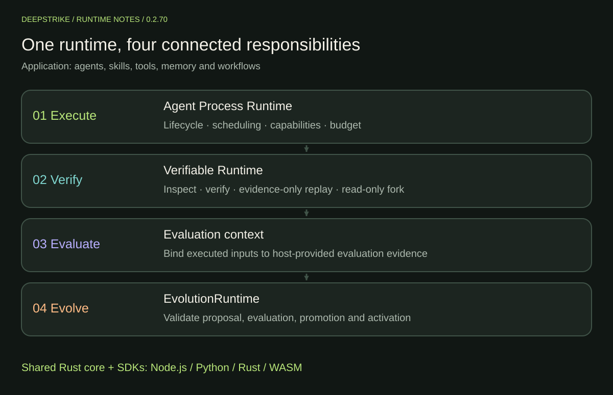
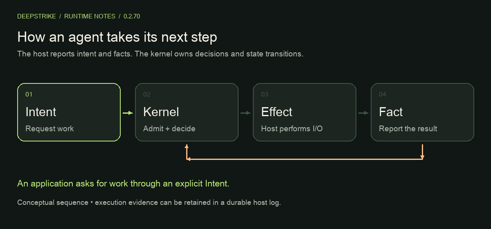
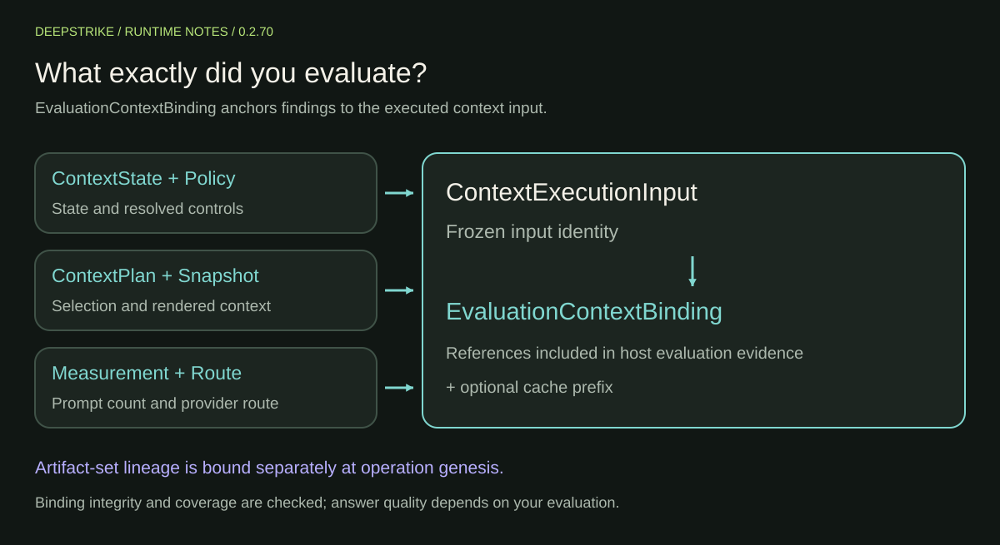
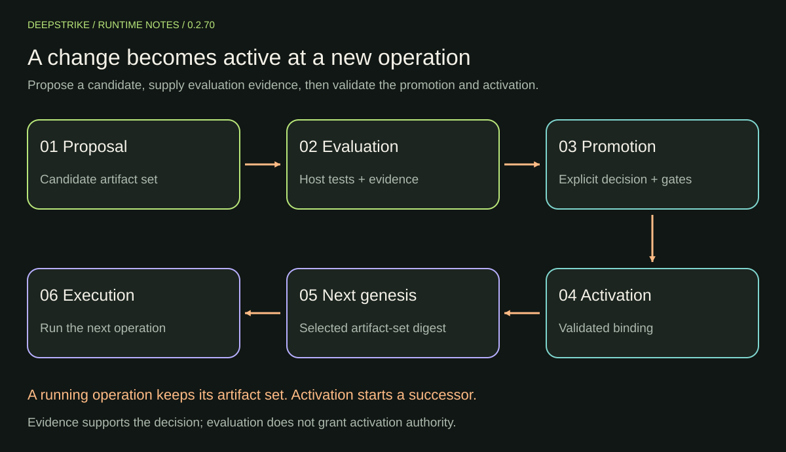

<p align="center">
  <a href="https://github.com/kongusen/deepstrike">
    
  </a>
</p>

<h1 align="center">DeepStrike</h1>

<p align="center">
  <strong>Build AI assistants that do useful work, work together, and leave a record you can check.</strong>
</p>

<p align="center">
  <a href="https://github.com/kongusen/deepstrike/releases"></a>
  <a href="https://www.npmjs.com/package/@deepstrike/sdk"></a>
  <a href="https://pypi.org/project/deepstrike/"></a>
  <a href="https://crates.io/crates/deepstrike-sdk"></a>
  <a href="https://discord.gg/cwS3RBYCv"></a>
  <a href="./LICENSE"></a>
</p>

<p align="center">
  <strong>English</strong>
  · <a href="./README.zh-CN.md">中文</a>
  · <a href="./docs/en/index.md">Documentation</a>
  · <a href="https://discord.gg/cwS3RBYCv">Discord</a>
</p>

---

DeepStrike helps developers build AI assistants that work through real tasks: gather information, use tools, remember project context, coordinate with other assistants, and ask for approval when needed.

You connect the models, data, tools, and rules for your application. DeepStrike provides the framework for running the work, controlling what each assistant can do, keeping execution records, and recovering interrupted tasks when durable storage is configured.

## DeepStrike at a glance

Execution, verification, evaluation, and governed evolution build on the same Agent Process Runtime foundation.



## What can you build?

| Application | A task you could give it | How DeepStrike helps |
| --- | --- | --- |
| **Research assistant** | “Compare these three vendors and prepare a recommendation.” | Connect search and document tools, divide the research, review the findings, and assemble a report with source references. |
| **Project knowledge assistant** | “Continue our proposal using the requirements we agreed on last time.” | Connect project documents and persistent memory so relevant information can be retrieved across tasks. |
| **Writing and review team** | “Turn this brief into a draft, then check facts and style.” | Give separate assistants research, writing, and review roles, with a defined sequence and revision limits. |
| **Development assistant** | “Investigate this bug, propose a fix, and run the checks.” | Connect repository and development tools, isolate delegated work, and control which actions need approval. |
| **Business workflow assistant** | “Group these customer issues, draft replies, and wait for approval before sending.” | Connect your business APIs, pass work between steps, and pause at approval points. |
| **Recurring reporting assistant** | “Prepare a briefing from the latest project updates.” | Let your application trigger the task on a schedule, gather information through connected tools, and retain records for follow-up. |

These are applications you can build with the framework. Search, email, databases, scheduling, and other external services are supplied by your application through tools, MCP integrations, or custom adapters.

## Example: a weekly research report

Suppose you want a weekly report about changes in your industry. Your application could define this workflow:

1. **Read the brief.** Load the topics, sources, and output format for this project.
2. **Gather information.** Use connected search and document tools. Split independent topics between assistants when useful.
3. **Review the draft.** Run your checks or a review assistant to flag missing sources and unanswered questions.
4. **Ask when needed.** Pause for a person's approval before an action you have marked as sensitive.
5. **Deliver and retain the work.** Save the report and execution records. With durable storage, an interrupted task can resume from recorded runtime state.

You choose the tools and the review criteria. The framework manages the task flow, delegation, limits, and records around them. The [example curriculum](./example/README.md) builds up from sourced Q&A to a multi-assistant editorial workflow in eight runnable levels.

### How work moves forward



[View the static diagram](./docs/public/readme/execution.svg). This is a conceptual runtime sequence. The host reports intent and external facts; the kernel owns admission, decisions, and state transitions. A model's tool request still passes through execution controls.

## What the framework takes care of

- **Tools and integrations.** Give assistants access to files, services, and MCP servers through a controlled execution boundary.
- **Reusable expertise.** Package specialized instructions and tool guidance as skills that can be loaded when needed.
- **Project memory.** Connect a persistent memory store and define what may be recalled or written.
- **Teamwork.** Run assistants in parallel, pass results to the next step, and set clear responsibilities.
- **Longer tasks.** Manage growing context, compress older material, and page large tool results as work continues.
- **Control.** Set permissions, budgets, deadlines, approval points, and cancellation rules.
- **Recovery and inspection.** Persist runtime state for recovery and keep evidence that helps explain what happened.

You can begin with one assistant and a few tools, then add the mechanisms your application needs. Model and integration availability varies by SDK.

## Make improvements with evidence

When you change an assistant's instructions, knowledge, tools, or rules, you need a way to judge the change. DeepStrike's **Evaluation Runtime** approach connects evaluation to the work that actually ran.



The binding identifies which executed input an evaluation refers to. Artifact-set lineage is bound separately at operation genesis; binding validation does not automatically replay every provider attempt.

| Question | What the 0.2.71 update provides |
| --- | --- |
| **What did this answer depend on?** | Links between a task and the information, instructions, and model configuration selected for it. |
| **Can we inspect an interrupted task?** | Records needed to recover and reconstruct task decisions, alongside records of tool and model activity. |
| **Did a new configuration help?** | Links between your test cases, scoring method, comparison results, and the old and new configurations. |
| **Which change was approved for use?** | A checked connection between the proposed change, review results, approval decision, and configuration selected for a new task. |

Your application runs the evaluations and supplies the success criteria. DeepStrike validates the recorded relationships and required checks. Human review, test suites, and model-based reviewers can provide evaluation evidence; the framework does not independently guarantee that an answer is correct.

The developer API for validating these change records is called `EvolutionRuntime`. See [evaluation inputs](./docs/en/architecture/evaluation-context.md) and [controlled evolution](./docs/en/architecture/evolution-runtime.md) for the implementation details.

### How a change reaches the next operation



Your application proposes a candidate configuration and supplies evaluation evidence. `EvolutionRuntime` checks lineage, evidence, and gates before returning an activation binding. The new configuration takes effect at the next operation boundary; a running operation keeps its existing artifact set.

## Get started

Choose an SDK: [Node.js](./node/README.md) · [Python](./python/README.md) · [Rust](./rust/README.md) · [WASM](./wasm/README.md).

For a first application, follow [Hello Agent](./docs/en/getting-started/hello-agent.md). To explore without provider credentials, use the examples' `--dry-run` mode.

<details>
<summary>Developer example: an assistant with a tool and a local execution log</summary>

Install the Node.js SDK and choose a model available to your account:

```bash
npm install @deepstrike/sdk@0.2.73
export OPENAI_API_KEY="your-api-key"
export OPENAI_MODEL="your-model-id"
```

Save this as `main.ts`, then run `npx tsx main.ts`:

```ts
import {
  createAgent,
  OpenAIResponsesProvider,
  tool,
} from "@deepstrike/sdk"

const apiKey = process.env.OPENAI_API_KEY
const model = process.env.OPENAI_MODEL
if (!apiKey || !model) throw new Error("Set OPENAI_API_KEY and OPENAI_MODEL")

const add = tool("add", "Add two numbers.", {
  type: "object",
  properties: { x: { type: "number" }, y: { type: "number" } },
  required: ["x", "y"],
}, async ({ x, y }) => String(Number(x) + Number(y)))

const agent = createAgent({
  name: "math",
  provider: new OpenAIResponsesProvider(apiKey, model),
  tools: [add],
})

const result = await agent.run("What is 17 + 28?")
console.log(result.output)
```

The Agent facade provides in-memory sessions by default. Configure a durable session store when recovery must survive process restarts; retain the payloads and other host data your tools and integrations require.

</details>

## What to plan for

DeepStrike is a framework you integrate into an application. You provide model access, external services, storage, and application-specific rules. Persistent memory and recovery require persistent stores; convenience APIs use in-memory defaults.

The task scheduler runs locally. Connecting remote tools does not provide a distributed worker system. Actions that affect an external system may be retried, so integrations should prevent duplicate side effects where necessary.

**Upgrading to 0.2.70:** upgrade the kernel and SDK bindings together and start new operations. Earlier saved runtime records and removed APIs have no automatic migration path. See [CHANGELOG.md](./CHANGELOG.md).

## Go deeper

| Goal | Guide |
| --- | --- |
| Build a sequence of tasks | [Workflows](./docs/en/guides/workflow.md) |
| Connect tools and services | [Tools and execution](./docs/en/guides/execution-plane-and-tools.md) |
| Add reusable expertise and project memory | [Skills](./docs/en/guides/skills.md) · [Memory](./docs/en/guides/memory.md) |
| Control what assistants may do | [Governance](./docs/en/guides/governance.md) |
| Recover and inspect work | [Session and recovery](./docs/en/guides/session-replay-and-recovery.md) · [Verification](./docs/en/architecture/verifiable-runtime.md) |
| Understand the architecture and its vocabulary | [Runtime Language](./docs/en/architecture/runtime-language.md) · [Context](./docs/en/architecture/evaluation-context.md) · [Evolution Runtime](./docs/en/architecture/evolution-runtime.md) |
| Contribute to the project | [Contributing](./CONTRIBUTING.md) · [API reference](./docs/en/reference/index.md) · [Security](./SECURITY.md) |

## License

DeepStrike is dual-licensed: free under MIT-style terms for individuals and organizations with annual revenue below USD 1,000,000; organizations at or above that threshold must obtain a commercial license from the author — see [LICENSE](./LICENSE) and [COMMERCIAL.md](./COMMERCIAL.md). Versions up to and including v0.2.62 remain available under the MIT License. It is an independent project and is not affiliated with or endorsed by any model provider.
