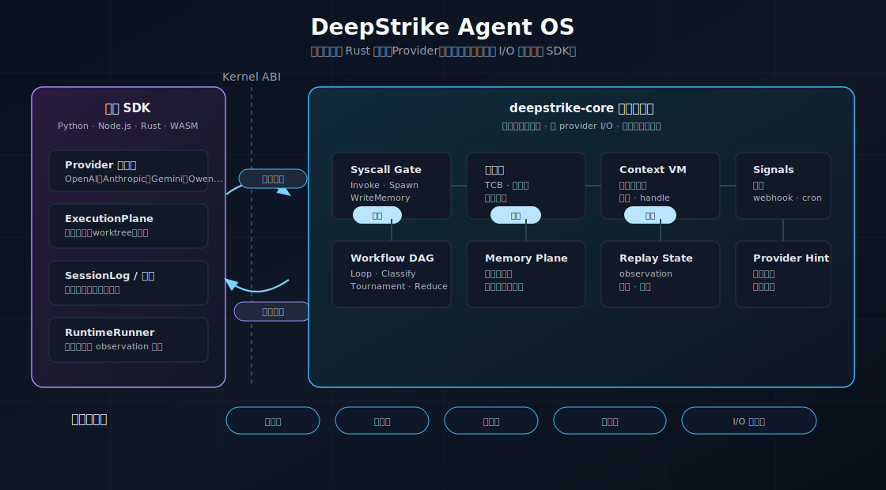

<p align="center">
  <a href="https://github.com/kongusen/deepstrike">
    
  </a>
</p>

<h1 align="center">DeepStrike</h1>

<p align="center">
  <strong>面向动态工作流、受治理工具、可重放会话与跨语言 Agent Runtime 的 Agent OS 微内核。</strong>
</p>

<p align="center">
  <a href="https://github.com/kongusen/deepstrike/releases"></a>
  <a href="https://www.npmjs.com/package/@deepstrike/sdk"></a>
  <a href="https://pypi.org/project/deepstrike/"></a>
  <a href="https://crates.io/crates/deepstrike-sdk"></a>
  <a href="https://www.anthropic.com/claude"></a>
  <a href="https://discord.gg/cwS3RBYCv"></a>
  <a href="./LICENSE"></a>
</p>

<p align="center">
  <strong>中文</strong>
  · <a href="./README.md">English</a>
</p>

<p align="center">
  <a href="./docs/index.md">文档</a>
  · <a href="./docs/getting-started/hello-agent.md">Hello Agent</a>
  · <a href="./docs/architecture/agent-os.md">Agent OS</a>
  · <a href="./docs/guides/workflow.md">动态工作流</a>
  · <a href="https://discord.gg/cwS3RBYCv">Discord</a>
</p>

---

DeepStrike 把 Agent 的「harness」升级为内核原语。

复杂任务里的现代 Agent 越来越像在写一个小型工作流：先分类，再扇出给多个子 Agent，校验输出，循环直到完成，最后综合结果。脚本里的 harness 很灵活，但也很脆：状态常在进程内存里，治理靠临时判断，中断恢复困难，每种语言还要重复实现一遍语义。

DeepStrike 把控制面放进 `deepstrike-core` 这个纯 Rust 状态机。宿主 SDK 仍然拥有所有真实 I/O：LLM 调用、工具、文件、worktree、网络、长期记忆与存储。内核决定 effect 何时、是否、在什么预算内发生；宿主执行获批的 effect，再把 observation 回灌给内核。

<p align="center">
  
</p>

## 你会得到什么

| 能力 | DeepStrike 提供什么 |
| :--- | :--- |
| **动态工作流调度器** | 声明式 DAG 加运行时 `SubmitNodes`；一等支持 `Loop`、`Classify`、`Tournament`、`Reduce`、fan-out、synthesize、generate-filter、verifier 等模式。 |
| **统一 syscall 治理** | 工具调用、子 Agent spawn、workflow 增长、memory 写入都走同一个 gate，得到 allow / deny / ask-user / rate-limit / quota 裁决。 |
| **Context VM** | 四槽位渲染（`system_stable`、`system_knowledge`、`turns`、`state_turn`）、压力压缩、大工具结果 handle 分页、prompt-cache 友好的稳定前缀，以及受治理的 knowledge 生命周期（键控条目、边界延迟驱逐、知识预算、skill 租约）。 |
| **Sub-agent 隔离** | role、上下文继承、capability filter、worktree / read-only / remote 隔离、进程 lineage、contract 与 handoff artifact。 |
| **重放与恢复** | append-only `SessionLog`、provider replay envelope、kernel observation、workflow resume、`wake(session_id)`、OS snapshot 与 repair 工具。 |
| **Memory 作为 OS 设备** | 内核校验的 `write_memory` / `query_memory`、DreamStore 集成、检索闭环、idle consolidation、memory 写入配额。 |
| **Provider 路由** | 内核只携带 `model_hint`；宿主把它解析到 OpenAI、Anthropic、Gemini、DeepSeek、Kimi、Qwen、GLM、Minimax、Ollama 或自定义 provider。 |
| **多模态输入** | 通过 `run({ attachments })` 在全部四个 SDK 中支持图像与音频，按厂商序列化（Anthropic block、OpenAI `image_url` / `input_audio`、Gemini `inlineData`）、按 detail 加权的 token 计量，以及以 `UnsupportedModalityError` 取代静默丢弃。 |
| **跨语言运行时** | 同一 Kernel ABI，在 Node.js、Python、Rust、WASM 中保持一致语义。 |

## 为什么是内核？

Agent OS 的分层边界很窄：

```text
LLM 产出计划或工具请求
        |
        v
deepstrike-core 决定：调度、门控、预算、压缩、快照
        |
        v
宿主 SDK 执行：provider、工具、文件、worktree、存储、webhook
        |
        v
Observation 回到内核与 SessionLog
```

这个边界带来的是脚本 harness 很难稳定获得的工程属性：

| 属性 | 脚本 harness | DeepStrike 内核 |
| :--- | :--- | :--- |
| 可重放 | 状态常在闭包变量或临时文件里 | control-flow observation 与 snapshot 可重建运行 |
| 受治理 | 每条工具路径各自写检查逻辑 | 一个 syscall gate 覆盖工具、spawn、memory、workflow append |
| 可恢复 | 中断后常要重跑 | SessionLog + `KernelSnapshot` 恢复挂起的 workflow |
| 跨语言 | SDK 之间语义容易漂移 | Rust 内核驱动所有宿主 |
| I/O 归属 | 控制流与凭据、副作用混在一起 | 内核纯计算；凭据和副作用归宿主 |

## 运行时分层

| 层 | 负责 | 不负责 |
| :--- | :--- | :--- |
| **Kernel (`deepstrike-core`)** | 状态机、调度、syscall disposition、governance、workflow DAG、预算账本、context 渲染、memory 校验、observation | HTTP、文件系统、provider client、向量存储、子进程 |
| **宿主 SDK** | runtime loop、provider 调用、工具执行、session 持久化、DreamStore、ArchiveStore、worktree 与 sandbox 集成 | 重写 spawn gate 或 workflow 语义 |
| **Provider** | 厂商协议适配、流式事件、replay envelope、模型 runtime policy | 策略裁决 |
| **ExecutionPlane** | 本地工具、流式工具、suspend/resume、worktree cwd 注入、进程沙箱、远程 VPC 工具、大结果 spool | Context 压缩 |

## 安装

| 运行时 | 包 | 安装 |
| :--- | :--- | :--- |
| Node.js / TypeScript | `@deepstrike/sdk` | `npm install @deepstrike/sdk` |
| Python | `deepstrike` | `pip install deepstrike` |
| Rust | `deepstrike-sdk` | `cargo add deepstrike-sdk` |
| Browser / Edge / WASM | `@deepstrike/wasm` | `npm install @deepstrike/wasm` |

当前工作区 SDK 版本：`0.2.42`。

## 快速开始

### Node.js / TypeScript

```bash
npm install @deepstrike/sdk
```

```ts
import { OpenAIProvider, runAgent, runFanout, tool } from "@deepstrike/sdk"

const add = tool("add", "两数相加。", {
  type: "object",
  properties: { x: { type: "number" }, y: { type: "number" } },
  required: ["x", "y"],
}, async ({ x, y }) => String(Number(x) + Number(y)))

const provider = new OpenAIProvider({
  apiKey: process.env.OPENAI_API_KEY!,
  model: "gpt-4.1-mini",
})

const answer = await runAgent({
  provider,
  goal: "17 + 28 等于几？",
  tools: [add],
})

const { synthesis } = await runFanout({
  provider,
  tasks: [
    "总结鉴权模块的风险画像。",
    "总结数据层的风险画像。",
  ],
  synthesize: "把这些发现合并成一份简洁审查结论。",
})
```

简单场景用 `runAgent`，无状态 handler 里的并行工作流用 `runFanout`，需要流式事件、SessionLog 持久化、工具、治理、signals、memory 或显式 workflow 控制时再下沉到 `RuntimeRunner`。

### Python

```bash
pip install deepstrike
```

```py
from deepstrike import OpenAIProvider, run_agent, run_fanout, tool

@tool
async def add(x: int, y: int) -> str:
    """两数相加。"""
    return str(x + y)

provider = OpenAIProvider(api_key="sk-...", model="gpt-4.1-mini")

answer = await run_agent(
    provider=provider,
    goal="17 + 28 等于几？",
    tools=[add],
)

out = await run_fanout(
    provider=provider,
    tasks=[
        "总结鉴权模块的风险画像。",
        "总结数据层的风险画像。",
    ],
    synthesize="把这些发现合并成一份简洁审查结论。",
)
synthesis = out["synthesis"]
```

### Rust

```toml
[dependencies]
deepstrike-sdk = "0.2.35"
```

### WASM

```bash
npm install @deepstrike/wasm
```

完整示例见各运行时 README：[Node.js](./node/README.md)、[Python](./python/README.md)、[Rust](./rust/README.md)、[WASM](./wasm/README.md)。

## 动态工作流模式

DeepStrike 把常见 harness 模式实现为一等 workflow 节点，而不是只靠 prompt 约定。

| 模式 | Kernel / SDK 表达 |
| :--- | :--- |
| Classify and act | `classify` 节点选择一个分支，并剪掉其余分支 |
| Fan out and synthesize | `runFanout` / `fanout_synthesize`：N 个 worker 加 synthesis barrier |
| Adversarial verification | `verify_rules`：每条规则一个全新上下文 verifier |
| Generate and filter | `generate_and_filter`：并行 generator 加 verifier barrier |
| Tournament | `tournament` 节点，两两 judge |
| Loop until done | `loop` 节点，带 `loop_continue`、`max_iters` 与运行时 `SubmitNodes` |
| Deterministic compute | `Reduce` 节点，内置 `concat`、`dedupe_lines`、`merge_json_arrays`、`count` 等 reducer |

详见：[动态工作流](./docs/guides/workflow.md)。

## 文档

| 阅读路径 | 从这里开始 |
| :--- | :--- |
| 新用户 | [Hello Agent](./docs/getting-started/hello-agent.md) 与 [API 选型](./docs/getting-started/run-agent-vs-runner.md) |
| Runtime 设计者 | [什么是 Agent OS](./docs/architecture/agent-os.md)、[内核与宿主分层](./docs/architecture/overview.md)、[执行模型](./docs/architecture/execution-model.md) |
| Workflow 构建者 | [动态工作流](./docs/guides/workflow.md)、[Sub-Agent 与协作](./docs/guides/sub-agents-and-collaboration.md)、[结构化输出与 Reducer](./docs/guides/structured-output-and-reducers.md) |
| 生产集成者 | [执行平面与工具](./docs/guides/execution-plane-and-tools.md)、[Governance](./docs/guides/governance.md)、[Provider 路由](./docs/guides/provider-routing.md) |
| 长上下文 Agent | [Context 工程](./docs/guides/context-engineering.md)、[Memory](./docs/guides/memory.md)、[Prompt Cache 设计](./docs/concepts/prompt-cache-design.md) |
| 重放与运维 | [Session、Replay 与恢复](./docs/guides/session-replay-and-recovery.md)、[OS Profile 与运行时快照](./docs/guides/os-profile-and-snapshots.md)、[Signals 与 Reactive](./docs/guides/signals-and-reactive.md) |
| 参考 | [RuntimeOptions](./docs/reference/runtime-options.md)、[WorkflowNodeSpec](./docs/reference/workflow-node-spec.md)、[Python API](./docs/reference/python-api.md)、[Kernel ABI](./docs/architecture/kernel-abi.md) |

本地运行文档站：

```bash
npm install
npm run docs:dev
npm run docs:build
```

## 仓库结构

```text
crates/deepstrike-core/   纯 Rust 内核状态机
crates/deepstrike-node/   Node.js 原生绑定
crates/deepstrike-py/     Python 原生绑定
crates/deepstrike-wasm/   WASM 绑定
node/                     TypeScript 宿主 SDK
python/                   Python 宿主 SDK
rust/                     Rust 宿主 SDK
wasm/                     浏览器与边缘 SDK
docs/                     VitePress 文档源
tests/                    跨语言集成测试
scripts/                  发布与校验自动化
```

## 本地开发

环境要求：Rust 1.85+ · Node.js 18+ · Python 3.10+

```bash
cargo build && cargo test
```

```bash
cd node && npm install && npm run build && npm test
```

```bash
cd python && python3 -m venv .venv && source .venv/bin/activate
pip install maturin pytest pytest-asyncio && maturin develop --release && pytest
```

```bash
cd wasm && npm install && npm run build && npm test
```

## 社区

- 加入开发者社区：[Discord](https://discord.gg/cwS3RBYCv)。
- 报告问题或提交需求：[GitHub Issues](https://github.com/kongusen/deepstrike/issues)。
- 提交 PR 前请先阅读 [CONTRIBUTING.md](./CONTRIBUTING.md)。
- 安全问题请通过 [SECURITY.md](./SECURITY.md) 中的流程报告。

## 许可证

DeepStrike 以 [MIT 许可证](./LICENSE) 发布。DeepStrike 是一个独立开源项目，受公开发表的 Agent 编码工具动态工作流工作启发；与 Anthropic 无隶属关系，也未获其背书。
