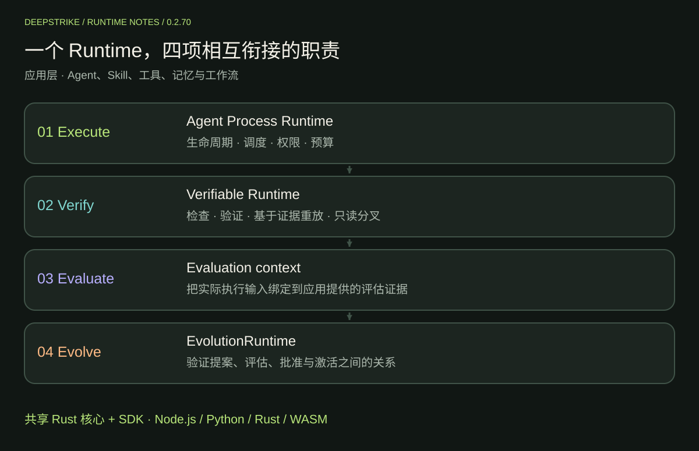
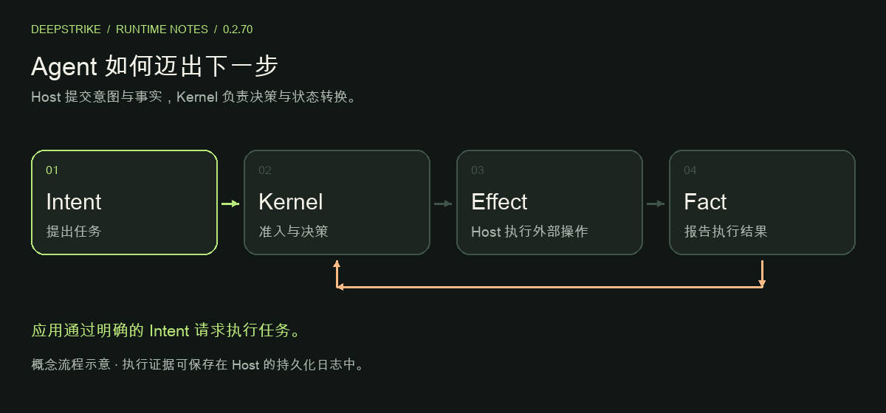
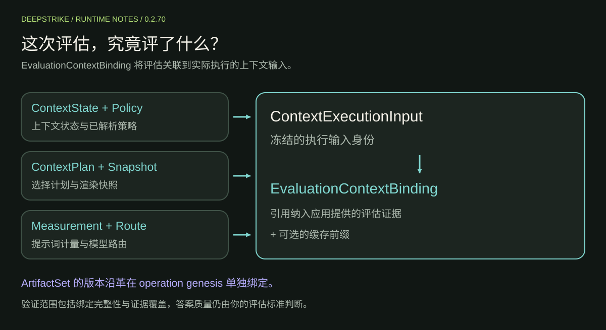
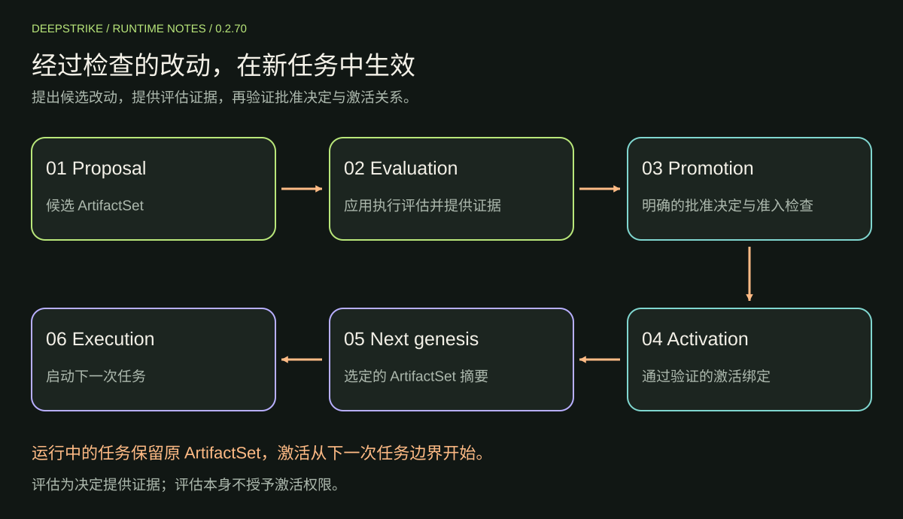

<p align="center">
  <a href="https://github.com/kongusen/deepstrike">
    
  </a>
</p>

<h1 align="center">DeepStrike</h1>

<p align="center">
  <strong>让 AI 助手能做事、能协作，工作过程可检查、改进有依据。</strong>
</p>

<p align="center">
  <a href="https://github.com/kongusen/deepstrike/releases"></a>
  <a href="https://www.npmjs.com/package/@deepstrike/sdk"></a>
  <a href="https://pypi.org/project/deepstrike/"></a>
  <a href="https://crates.io/crates/deepstrike-sdk"></a>
  <a href="https://discord.gg/cwS3RBYCv"></a>
  <a href="./LICENSE"></a>
</p>

<p align="center">
  <strong>中文</strong>
  · <a href="./README.md">English</a>
  · <a href="./docs/index.md">文档</a>
  · <a href="https://discord.gg/cwS3RBYCv">Discord</a>
</p>

---

DeepStrike 帮助开发者搭建能完成实际任务的 AI 助手。它可以查资料、调用工具、记住项目背景、与其他助手分工，并在需要时等待人的确认。

你为应用接入模型、资料、工具和工作规则，DeepStrike 负责组织任务执行、限制助手的权限、保留执行记录，并在配置持久化存储后支持中断恢复。

## 一图看懂 DeepStrike

从任务执行、过程验证到评估与受控演进，Agent Process Runtime 是整套机制的执行基础。



## 你可以用它做什么

| 你想搭建的应用 | 可以交给它的任务 | DeepStrike 如何帮助你实现 |
| --- | --- | --- |
| **研究与资料整理助手** | “比较这三家供应商，整理差异并给出建议。” | 接入搜索和文档工具，分工调研、复核发现，再汇总成带来源的报告。 |
| **项目知识助手** | “根据上次确定的要求，继续完善这份方案。” | 接入项目文档和持久记忆，让助手在后续任务中检索相关背景。 |
| **写作与审稿团队** | “按这份需求写初稿，再检查事实和表达。” | 分配研究、写作、审稿角色，设定交接顺序和修改次数。 |
| **研发协作助手** | “调查这个 bug，提出修改并运行检查。” | 接入代码仓库与开发工具，隔离委托任务，并控制哪些操作需要审批。 |
| **业务流程助手** | “归类这些客户问题，生成回复草稿，批准后再发送。” | 接入业务接口，把工作传给下一步骤，在审批节点暂停。 |
| **日报与简报助手** | “根据最新项目进展，准备一份简报。” | 由你的应用定时触发任务，通过已接入的工具收集信息，并保留后续跟进需要的记录。 |

这些是可以用框架搭建的应用。搜索、邮件、数据库、定时触发等外部能力，需要由你的应用通过工具、MCP 集成或自定义适配器接入。

## 举个例子：研究助理如何完成一份周报

假设你每周需要一份行业动态报告，可以把工作安排成下面的流程。

1. **读取任务要求。** 加载项目关心的主题、资料来源和报告格式。
2. **收集资料。** 使用已接入的搜索与文档工具；独立的主题可以交给不同助手并行研究。
3. **复核初稿。** 用你设定的检查规则或审稿助手，找出缺少来源、尚未回答的问题。
4. **需要时请人确认。** 在你标记为敏感的操作前暂停，等待审批。
5. **交付并保留过程。** 保存报告与执行记录；配置持久化存储后，中断的任务可以根据已记录的运行状态继续。

你决定使用哪些工具、按照什么标准审查。框架负责这些工作之间的调度、分工、限制和记录。[示例课程](./example/README.md) 用八个可运行等级，从带来源的问答逐步搭建到多个助手协作的编辑流程。

### 一次任务如何向前推进



[查看静态流程图](./docs/public/readme/execution-zh.svg)。这是运行机制示意。Host 提交意图和外部事实，Kernel 负责准入、决策与状态转换；模型提出的工具调用仍需经过执行控制。

## 框架替你处理哪些工作

- **接入工具。** 让助手在受控边界内使用文件、外部服务和 MCP Server。
- **复用专业能力。** 把专门的工作指引和工具说明整理成 Skill，任务需要时再加载。
- **保留项目记忆。** 接入持久记忆存储，规定哪些信息可以被召回和写入。
- **安排分工。** 让多个助手并行工作、交接结果，并各自承担明确职责。
- **支持较长任务。** 管理不断增长的上下文，压缩较早的内容，对大型工具结果分页处理。
- **控制执行。** 设置权限、预算、时限、审批节点和取消规则。
- **恢复和检查。** 保存用于恢复的运行状态，以及帮助解释执行过程的证据。

可以从一个助手和几个工具开始，按应用需要增加能力。各 SDK 支持的模型和集成范围有所不同。

## 让每次改进有依据

当你修改助手的指令、知识、工具或规则时，需要判断这些变化是否值得采用。DeepStrike 的 **Evaluation Runtime** 思路，是把评估与实际执行的任务联系起来。



图中的绑定回答“这份评估对应哪份执行输入”。ArtifactSet 的版本沿革在任务起点单独绑定；绑定验证不会自动重放所有模型请求。

| 你关心的问题 | 0.2.71 提供的支持 |
| --- | --- |
| **这个结果基于什么产生？** | 把一次任务与当时选用的资料、指令和模型配置关联起来，便于追查。 |
| **任务中断后，还能检查过程吗？** | 保留恢复和重现任务决策所需的记录，以及工具和模型的调用过程。 |
| **换一套配置，效果有没有改善？** | 把你使用的测试资料、评分方式、对比结果和检查记录，关联到新旧两套配置。 |
| **这次采用的改动经过什么检查？** | 把候选改动、检查结果和批准决定连在一起，验证新任务采用这套配置的依据。 |

应用负责执行评估并提供成功标准，DeepStrike 验证记录之间的关系与必要检查。人工审查、测试程序和模型评审都可以成为证据来源；框架本身不独立保证答案正确。

开发者用于验证这些变更记录的 API 名称是 `EvolutionRuntime`。具体机制见 [评估输入](./docs/architecture/evaluation-context.md) 与 [受控演进](./docs/architecture/evolution-runtime.md)。

### 改动如何进入下一次任务



应用提出候选配置并提供评估证据。`EvolutionRuntime` 检查版本沿革、证据与准入条件，验证通过后才返回激活绑定。新配置从下一次任务开始生效，运行中的任务继续使用原有 ArtifactSet。

## 从哪里开始

选择适合你的 SDK：[Node.js](./node/README.md) · [Python](./python/README.md) · [Rust](./rust/README.md) · [WASM](./wasm/README.md)。

第一个应用可以跟随 [Hello Agent](./docs/getting-started/hello-agent.md) 完成。想先体验流程，可以运行示例中的 `--dry-run`，无需配置 Provider 凭据。

<details>
<summary>开发者示例：带一个工具和本地执行日志的助手</summary>

安装 Node.js SDK，选择你的模型账户可用的模型。

```bash
npm install @deepstrike/sdk@0.2.70
export OPENAI_API_KEY="your-api-key"
export OPENAI_MODEL="your-model-id"
```

将以下代码保存为 `main.ts`，运行 `npx tsx main.ts`。

```ts
import {
  createAgent,
  OpenAIResponsesProvider,
  tool,
} from "@deepstrike/sdk"

const apiKey = process.env.OPENAI_API_KEY
const model = process.env.OPENAI_MODEL
if (!apiKey || !model) throw new Error("Set OPENAI_API_KEY and OPENAI_MODEL")

const add = tool("add", "Add two numbers.", {
  type: "object",
  properties: { x: { type: "number" }, y: { type: "number" } },
  required: ["x", "y"],
}, async ({ x, y }) => String(Number(x) + Number(y)))

const agent = createAgent({
  name: "math",
  provider: new OpenAIResponsesProvider(apiKey, model),
  tools: [add],
})

const result = await agent.run("What is 17 + 28?")
console.log(result.output)
```

Agent facade 默认使用进程内 Session。需要跨进程恢复时配置持久化 Session 存储；生产环境还需要保留工具与集成所依赖的 payload 等 Host 数据。

</details>

## 使用前需要准备什么

DeepStrike 是供开发者接入应用的框架。你需要提供模型访问、外部服务、存储和具体业务规则。持久记忆与恢复需要持久化存储，便捷 API 默认使用内存。

任务调度器在本地运行，接入远程工具不等于获得分布式 worker 系统。影响外部系统的操作可能被重试，集成时应按需避免重复产生副作用。

**升级到 0.2.70 时：** Kernel 与 SDK bindings 需要一起升级，并创建新 operation。旧运行记录和已移除的 API 没有自动迁移路径，详见 [CHANGELOG.md](./CHANGELOG.md)。

## 继续了解

| 你想做什么 | 文档入口 |
| --- | --- |
| 安排一组有先后关系的任务 | [Workflow](./docs/guides/workflow.md) |
| 接入工具与外部服务 | [工具与执行](./docs/guides/execution-plane-and-tools.md) |
| 添加专业指引与项目记忆 | [Skill](./docs/guides/skills.md) · [Memory](./docs/guides/memory.md) |
| 控制助手可以做什么 | [治理](./docs/guides/governance.md) |
| 恢复与检查任务 | [Session 与恢复](./docs/guides/session-replay-and-recovery.md) · [执行验证](./docs/architecture/verifiable-runtime.md) |
| 理解架构及其术语 | [运行时语言字典](./docs/architecture/runtime-language.md) · [Context](./docs/architecture/evaluation-context.md) · [Evolution Runtime](./docs/architecture/evolution-runtime.md) |
| 参与项目开发 | [贡献指南](./CONTRIBUTING.md) · [API 参考](./docs/reference/index.md) · [安全问题](./SECURITY.md) |

## 许可证

DeepStrike 采用双授权：个人及上一财年总营收低于 100 万美元的组织可按 MIT 条款免费使用；达到或超过该阈值的组织须联系作者获取商业授权——详见 [LICENSE](./LICENSE) 与 [COMMERCIAL.md](./COMMERCIAL.md)。v0.2.62 及之前的版本继续适用 MIT 协议。这是一个独立项目，不隶属于任何模型提供商，也未获得任何模型提供商背书。
