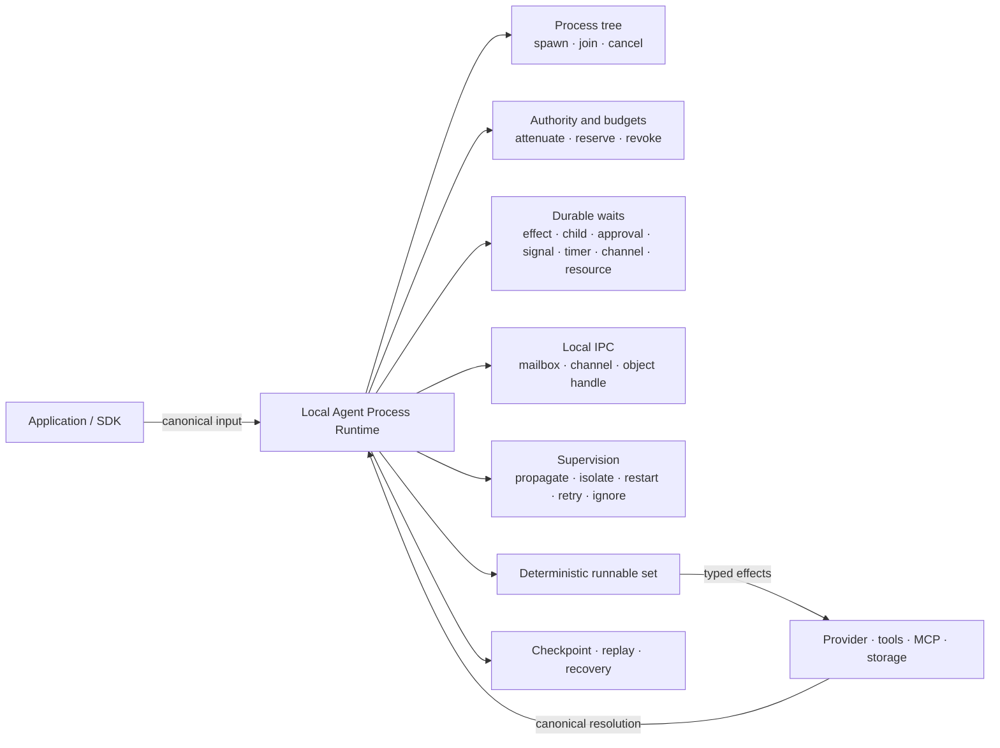

# Agent Process Runtime

DeepStrike 的主线能力是一个 **本地 Agent Process Runtime**。它把一次根 Agent 运行、子 Agent 和 Workflow 节点统一为由内核管理的本地任务，让长时间 Agent 工作拥有明确的进程树、权限、预算、等待、通信、故障处理和恢复语义。

这里的 “Process” 是运行时概念，不要求每个 Agent 对应一个操作系统进程。应用仍然使用 `RuntimeRunner`、Agent、Workflow、Signal 和 Session 等公开接口；`Tcb`、`WaitSet` 和本地 IPC 是这些接口背后的内核机制。

## 为什么需要 Process Runtime

简单的 Agent loop 能完成一次模型调用，却很难稳定回答这些问题：

- 谁创建了当前任务，它可以再创建多少子任务？
- 子任务能使用哪些能力，预算从哪里来？
- 等待工具、审批、Signal 或另一个 Agent 时，状态如何持久化？
- 一个子任务失败后，父任务应该传播失败、隔离、重启、重试还是忽略？
- 中断恢复后，调度顺序、等待进度和 IPC 是否仍然一致？

Agent Process Runtime 把这些问题放进同一个可检查、可重放的状态机，而不是分散在 SDK 的临时 async loop 中。

## 运行时模型

一次 Operation 是本地运行边界。根 Agent 是进程树的根；子 Agent 和 Workflow 节点通过同一套 spawn、join、cancel、预算和监督语义运行。宿主负责执行网络、模型和工具等外部 Effect，内核负责决定什么可以运行以及状态如何变化。

## 七项核心能力

| 能力 | 运行时语义 | 面向开发者的表现 |
| --- | --- | --- |
| 进程树 | 根任务、父子谱系、spawn、join、cancel | Sub-Agent 和 Workflow 节点共享一致的生命周期 |
| 持久等待 | `Any` / `All` 等待集合覆盖 Effect、子任务、审批、Signal、Timer、Channel、Resource 和外部订阅 | 等待不占用可运行槽位；恢复后继续等待 |
| 权限衰减 | 内核从实际调用者派生子任务权限，支持 capability lease 与 revoke | 子 Agent 不能自行扩大权限 |
| 层级预算 | tokens、cost、turns、wall time、child tasks、并发子任务、tool calls、memory writes、object bytes 九个维度逐级预留与结算 | 子任务总授权不能超过父任务剩余预算 |
| 本地 IPC | 点对点 Mailbox、Channel fan-out 与只传 handle 的对象描述符 | Agent 间交换消息和大对象引用，不复制未授权内容 |
| 监督 | `Propagate`、`Isolate`、`Restart`、`Retry`、`Ignore`，重启与重试受 attempt 上限约束 | 子任务失败行为可预测并留下事件记录 |
| 确定性调度 | 根任务、Workflow 节点、waiter 和监督重启进入统一 runnable set | 相同 canonical input 与 checkpoint 产生稳定的调度选择 |

## 不可绕过的约束

这些约束由内核状态转换维护，而不是依赖调用方自律：

1. 子任务的父节点来自当前实际调用者，宿主不能伪造谱系。
2. 子任务能力只能等于或弱于父任务当前有效能力。
3. 所有未结算的子任务预算授权之和不能超过父任务剩余预算。
4. 正在等待的任务不是 runnable；满足条件后只完成一次有效唤醒。
5. Mailbox 和 Channel 只负责传递消息；读取对象仍需要匹配的 capability。
6. Checkpoint 保存进程树、等待进度、预算、IPC 和监督状态，使恢复成为状态机延续。

外部 Effect 采用至少一次交付语义。宿主集成应使用稳定的 Effect ID 或 launch token 实现幂等，避免恢复或重试造成重复副作用。

## 与公开能力的关系

Agent Process Runtime 是 DeepStrike 能力的共同底座，不是一套与现有 API 平行的新产品面：

| 公开能力 | Process Runtime 提供的底层语义 |
| --- | --- |
| `RuntimeRunner` | canonical input、Effect resolution、checkpoint 与 terminal disposition |
| Sub-Agent 与 Handoff | 进程树、权限衰减、预算预留、join 和监督 |
| Workflow | 统一 runnable set、依赖等待和节点生命周期 |
| Signal 与审批 | 可持久化 WaitSet 和事件驱动唤醒 |
| Session 恢复 | checkpoint、journal、replay 和幂等 Effect |
| Governance | 实际 caller、capability、lease、revoke 和资源边界 |

这也解释了为什么 DeepStrike 不把 Agent 仅仅描述为一段 prompt workflow：Provider 可以替换，工具可以远程执行，但 Agent 的身份、权限、资源和连续性由本地运行时持续维护。

## 当前边界

当前实现聚焦 **单机、本地、可持久化** 的 Agent Process Runtime。Remote tool、MCP Server、queue 和 sandbox 可以作为宿主 Effect 接入，但它们不改变本地进程树的所有权。

当前范围不包含分布式 worker lease、fencing、任务迁移、故障接管或跨节点 broker。这些能力需要独立的分布式一致性协议，不能从本地 checkpoint 和 replay 语义中默认推导出来。

## 从哪里继续

- [Agent 如何运行](./index) — 从一次 Agent 回合理解整体路径
- [内核与宿主分层](./overview) — 模块与 effect loop
- [Sub-Agent 与 Handoff](../guides/sub-agents-and-collaboration) — 进程树的开发者用法
- [Workflow](../guides/workflow) — DAG 与统一调度
- [Signals 与 Reactive Agent](../guides/signals-and-reactive) — 事件驱动唤醒
- [Session 与恢复](../guides/session-replay-and-recovery) — checkpoint、replay 和恢复
- [治理与限制](../guides/governance) — capability 与资源边界
