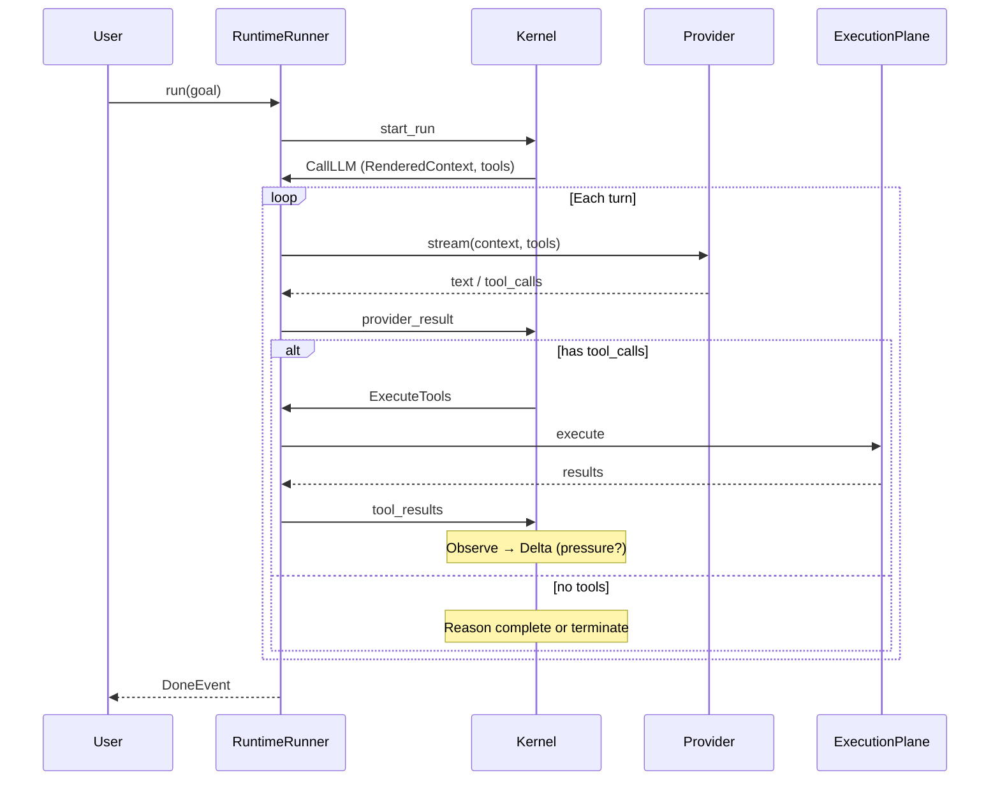

# 执行模型

本文从 **一次 agent turn** 出发，说明 Agent OS 如何在宿主与内核之间协作。读完应能回答：「用户发一句话后，内核与 SDK 各做了什么？」

## 参与者

| 角色 | 实现 |
|------|------|
| **Kernel** | `KernelRuntime` / `LoopStateMachine` |
| **Host** | `RuntimeRunner` |
| **Evidence** | `SessionLog`（append-only events） |

## 生命周期：从 start_run 到 Done




## Phase 1 — Reason：内核决定「问模型什么」

1. `ContextManager` 合并分区，产出 `RenderedContext`（四槽位）
2. 根据 `active_skills`、`capability_filter`、governance **收窄** 暴露的 tool schema
3. 返回 `KernelAction::CallLLM`

**内核决定**：哪些 history 可见、哪些工具可调用、state_turn 里有什么 task/directives。

**SDK 决定**：无（只转发给 Provider）。

## Phase 2 — Act：模型提议副作用

Provider 返回 `tool_calls` 或纯文本。

- 纯文本且无未完成计划 → 可能 `Done`
- 有 `tool_calls` → 内核进入 `Act`，对每个 call 发起 **`Syscall::Invoke`**

### Syscall 裁决（Governance）

```text
Invoke(read_file)  →  Allow → ExecuteTools
Invoke(rm_rf)      →  Deny  → rollback note 写入 context，不执行
Invoke(deploy)     →  Gate(AskUser) → Suspended，SDK 弹 PermissionRequestEvent
```

工具与 spawn、memory write **同一套** pipeline（rate limit → permission → constraint → veto）。

Meta-tools（`skill`、`memory`、`submit_workflow_nodes`）由内核 **内建处理**，不交给 ExecutionPlane。

## Phase 3 — Observe：结果回灌

SDK 将 `ToolResult` / `ProviderResult` 作为 `KernelInput` 喂回：

- History 分区追加 message
- Handle 表注册大结果（可选 spool）
- `PressureMonitor` 采样 token 占用

## Phase 4 — Delta：压力与压缩

若 `pressure > threshold`：

1. 运行 `CompressionPipeline`（Snip → Drop → Summarize）
2. 可能触发 `Renewal` / handoff
3. 更新 `frozen_prefix_len`（prompt cache 断点）

此阶段 **不调用 LLM**（Summarize 除外——由 SDK 侧 summarizer 执行）。

## Sub-agent spawn（Workflow 节点）

Workflow 节点 ready 时，内核返回 spawn 描述符而非直接 CallLLM 根任务：

```text
Syscall::Spawn(manifest)
  → quota 检查（深度、并发、累计 spawn）
  → trust 检查（quarantined 不可提权）
  → Allow → SDK SubAgentOrchestrator.run(AgentRunSpec)
  → sub_agent_result 回灌 → DAG 推进
```


子 agent 拥有 **独立 TCB**、独立 `max_tokens` / `token_budget`、可选 `isolation: worktree`。

## Memory syscall（环外也可调用）

`write_memory` / `query_memory` 可在 run 循环外由 SDK 直接 `kernel_apply`：

```text
Syscall::WriteMemory → 内核校验 metadata → observation memory_written → SDK commit DreamStore
Syscall::QueryMemory  → SDK search DreamStore → 内核 emit retrieval → 注入 knowledge 分区
```

Memory **不** 绕过 governance validation。

## 挂起与恢复

| 挂起原因 | TaskState | 恢复方式 |
|----------|-----------|----------|
| AskUser | Suspended | `on_permission_request` → resume event |
| Sub-agent | Suspended | orchestrator 完成 → `sub_agent_result` |
| External | Suspended | signal / user interrupt → `signal` event |

SessionLog 记录挂起点；`wake` 从 log 重建 `KernelRuntime` 状态。

## 与「普通 agent 框架」的差异

| 步骤 | 典型框架 | Agent OS |
|------|----------|----------|
| 工具调用 | SDK if/else 拦截 | 内核 syscall + 统一 Disposition |
| 子 agent | 新开一个 client | TCB + TaskTable + 同一 SessionLog lineage |
| 压缩 | 截断 messages 数组 | 分区 pipeline + cache-aware + handle page-out |
| 工作流 | 外部 orchestrator | 内核 WorkflowRun + gated spawn |

## 延伸阅读

- [Kernel ABI](./kernel-abi) — event/action 字段级说明
- [Session 与重放](./session-replay)
- [Governance](../guides/governance)
