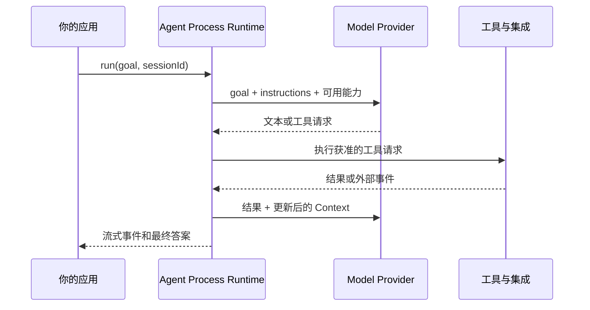

# Agent Process Runtime 总览

DeepStrike 为模型调用周围的 Agent 提供一个本地 Agent Process Runtime。Agent 接收目标，判断需要什么能力，使用可用工具和知识；运行时把根 Agent、子 Agent 与 Workflow 节点放进一棵可持久化的进程树，并维护它们的权限、预算、等待、调度和恢复状态。

先阅读 [Agent Process Runtime](./agent-process-runtime) 了解完整能力边界。本页从一次公开 Agent 回合解释应用、内核、Provider 与工具如何协作。

## 一次 Agent 回合



应用负责 Provider 和外部集成。DeepStrike 内核维护 Agent 的进程树、决策 Context、策略、等待和 Session 状态，让长任务不依赖一段脆弱的 async loop。

## Agent 持有什么

| Agent 关注点 | 表达方式 |
| --- | --- |
| 身份 | Name、instructions、model、tools、skills、memory、knowledge、handoffs 和 guardrails |
| 能力 | 类型化工具、MCP Server、Provider 特性、Skill 和应用集成 |
| 工作 Context | 稳定指令、已加载 Knowledge、对话 turn、召回 Memory 和当前任务状态 |
| 协作 | 子 Agent、角色、隔离、依赖、contract 和 handoff artifact |
| 时间 | Turn、有界循环、sleep、wake、审批、Signal 和外部事件 |
| 质量 | 输出 schema、Reducer、验证 Agent、评估 hook 和 Milestone |
| 连续性 | Session Log、Checkpoint、Replay fixture 和中断后的恢复 |

## 能力如何组合

从一个 Agent 开始，只在任务需要时逐步增加能力。

```text
单 Agent
  + 工具与 Provider
  + Memory 与 Skill
  + 策略与审批
  + 长时间运行 Session 与 Signal
  + 专业 Agent 工作流
  + Reactive peer 团队
```

[Research Brief Studio 课程](https://github.com/kongusen/deepstrike/tree/main/example) 就是这条成长路径。

## 应用开发者需要决定的边界

应用仍然决定工具在哪里运行、持久 Memory 存在哪里、审批如何回答以及 billing 如何计算。DeepStrike 提供 Agent-facing contract 和运行时事件，让这些决定变得明确。

应用可以接入 remote tool、MCP Server、queue 和 sandbox。它们是围绕 Agent 的集成，不代表框架提供分布式 worker 系统。

## 延伸阅读

- [Agent Process Runtime](./agent-process-runtime) — 进程树、等待、预算、IPC、监督与恢复
- [Agent 能力指南](/guides/)
- [Session 与恢复](/guides/session-replay-and-recovery)
- [实现参考](./overview)
- [Kernel ABI 参考](./kernel-abi)
