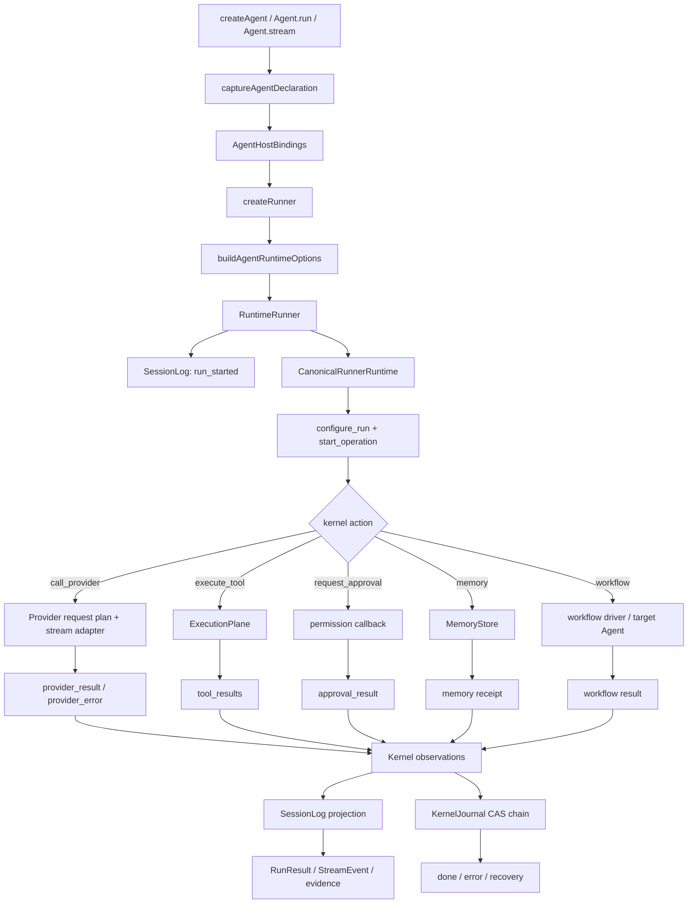

# Node.js SDK 完整数据流与契约机制分析

本文描述当前 Node.js SDK 的真实运行路径、数据权威、持久化与恢复关系，以及类型驱动边界契约如何约束这些路径。分析对象是 `node/src`、`contracts` 和 Canonical Kernel 的集成面；Python、WASM、Rust 的实现方式不在本文范围内。

## 结论先行

Node SDK 不是“调用一次 provider，再把结果返回”的薄封装。它是一个由宿主驱动的执行系统：

1. public API 产生声明和一次运行请求。
2. host 将声明绑定成可执行的 `RuntimeOptions`。
3. `RuntimeRunner` 将策略和初始状态投影进 Canonical Kernel。
4. kernel 只返回受控 action，host 执行 provider、工具、memory、payload、approval 和 workflow 等外部副作用。
5. 每个副作用的结果带着 kernel 铸造的 `effect_id` 回到 kernel。
6. kernel 的 journal 是执行事实，`SessionLog` 是面向业务和审计的事件投影。
7. provider wire、工具输出和生命周期事件都必须沿同一 run/session/operation 关联链结束，才能支持恢复和 replay。

因此，最重要的架构判断是：

- **Kernel 是控制事实的权威**，host 是执行和外部资源的权威，provider 是 vendor wire 的权威。
- **SessionLog 不是 canonical state**。它不能独立证明一个运行仍然活跃，恢复必须回到 `KernelJournal`。
- **类型字段映射只能解决局部形状问题**；`effect_id`、signal disposal、run-context isolation 等跨记录关系必须由 global invariants 约束。
- **动态 workflow 已经进入同一 `RuntimeRunner` 执行权威**，不再有第二个公共执行入口；但 VM 仍是 host 隔离层，不等同于操作系统级租户沙箱。

## 1. 四层模型和权威分工

| 层 | 权威 | Node SDK 代表 | 负责什么 |
| --- | --- | --- | --- |
| public | public-agent | `Agent`、`AgentDefinition`、workflow public types | 用户声明、调用意图、输入输出类型 |
| host | host-runtime | `AgentRuntimeImpl`、`RuntimeRunner`、provider adapters、`ExecutionPlane`、MemoryStore | 绑定运行资源、执行外部副作用、保存 provider 和业务证据 |
| kernel | canonical kernel | `CanonicalRunnerRuntime` 和 `CanonicalKernel` | action、effect、预算、上下文状态、workflow DAG、终态和 replay 事实 |
| provider | vendor/provider | Anthropic、OpenAI、Gemini、Ollama adapters | vendor 请求、流格式、usage 和 provider replay 信息 |

这四层不是四个独立 SDK。它们在一个 Node 进程中协作，但仍然有不同的 authority。host 可以把 public 声明降低为运行配置，也可以把 kernel action 执行成外部调用；host 不得把自己的判断伪装成 kernel 事实，provider 也不得把 vendor 方言直接泄漏为 kernel 语义。

## 2. 一次普通 Agent run 的完整数据流

### 2.1 Public 入口和声明快照

`createAgent()` 在 `node/src/agent-facade.ts` 中创建 `AgentRuntimeImpl`。构造阶段调用 `captureAgentDeclaration()`，把可序列化的声明深复制并冻结，同时把不可序列化的执行依赖留在 `AgentHostBindings`：

- 声明快照包括 name、instructions、output schema、skills、knowledge、guardrails、handoffs、provider options 和 memory 描述。
- host binding 保存 provider、execution plane、session log、memory store/scope、工具函数、vector retriever 和 runtime binding。
- 声明可以被审计、缓存和比较；执行句柄和外部对象不进入声明快照。
- memory 的 `{kind, namespace, binding}` 描述声明和绑定状态：`runtime` 表示 `memoryStore + memoryScope` 已绑定，`declaration` 表示只有可序列化声明、尚未接入运行时存储；后者会让 `remember()`/`recall()` 在 facade 入口立即失败。声明 namespace 与 runtime scope 不一致时，Agent 创建阶段直接拒绝。

这个分离让 public 对象不再承担执行状态，但也带来一个必须保持的规则：**声明里的字段只有在 `buildAgentRuntimeOptions()` 被映射并被 runner 消费时才算有执行语义**。

### 2.2 Runner 构造和唯一 live lowering

`AgentRuntimeImpl.createRunner()` 先解析 provider，再准备 MCP 或本地 `ExecutionPlane`，最后调用 `buildAgentRuntimeOptions()`。这个函数是当前 public→host 的真实入口，负责：

- 合并声明级和本次运行的 `providerOptions`，run 级值覆盖声明级值。
- 从 execution plane schema 计算 `baselineToolIds`。
- 组合 instructions 和 output schema 形成 system prompt。
- 放入 maxTokens、maxTurns、capability filter、session log、agentId、memory binding、skills、knowledge source。
- 合并 runtime binding 和 guardrail，避免尾部对象展开静默覆盖治理策略。
- 将 workflow target resolver 封装成 host-side `workflowAgentResolver`。

这意味着旧的形式 IR 或独立的 lowering 旁路不能再作为架构真相。契约 `agent.public-to-host` 应当绑定 `runtime/agent-runtime-options:buildAgentRuntimeOptions` 以及真实 facade path 的行为测试。

### 2.3 `RuntimeRunner.run()` 的启动阶段

`RuntimeRunner.run()` 先从当前 session 读取历史；如果是同一 run 的中断恢复，会根据 `run_started` 和 kernel journal 判断是否存在未终止 canonical operation。新 run 才追加 `run_started`，并生成 `runId`；继承的父 transcript 只作为子操作输入，不能充当子操作的恢复证据。

`execute()` 的启动顺序是：

1. 创建 `CanonicalRunnerRuntime`，绑定 `node-operation-${runId}`、journal 和 payload persister。
2. 首次运行时向 kernel 写入 tokenizer、plan tool、完整 tool schema、system prompt、initial memory、skill catalog、stable core tools、memory/knowledge 开关和 milestone contract。
3. 有历史时先给 provider 注入 replay 状态，再把 SessionLog 历史重放为 canonical `preload_history`；压缩 archive 通过 payload/compression store 加载。
4. 计算 `AgentRunSpec`，应用 capability filter、allowed tool ceiling、baseline exposure 和 verification contract。
5. 应用 governance、context、reliability、signal、resource quota 等复合 `configure_run` policy。
6. 预取长期 memory，种入 attachment，最后提交 `start_operation`，拿到第一个 kernel action。

重要的是，配置不是“传给 kernel 的一堆 options”。它们在启动阶段被降低成有序、可 journal 的输入；恢复时从 journal/checkpoint 的 canonical config 重建，而不是重新相信 host 当前默认值。

## 3. Canonical Kernel action loop

主循环位于 `node/src/runtime/runner.ts` 的 `execute()`。每一轮先把 pending observations 投影到 SessionLog，再处理中断、signal 和当前 action。action 是 kernel 决定的下一步，host 不能跳过 pending effect 直接结束。

### 3.1 Provider 分支

`call_provider` 的实际顺序如下：

1. 从 action 中取 kernel 铸造的 `effectId`，维护 provider invocation chain。
2. 将 kernel 渲染好的 context 加上 tool-output overlay，应用 governance schema 过滤。
3. 通过 `prepareProviderRequest()` 和 `createProviderRequestPlanForProvider()` 得到 provider-specific request plan 和 request fingerprint。
4. 复用历史中同 fingerprint 的 prompt measurement；没有可信测量时执行 native count 或 heuristic fallback。
5. 若 context 或可信 measurement 超过预算，在任何 transport 发生前写入 `provider_attempt(status=rejected)`，把 `provider_error(context_overflow)` 交回 kernel。
6. 通过 `context_prepared` 记录 provider route、request fingerprint 和准备结果。
7. 消费 `preparedRequest.stream()`：文本和 tool call 作为 SDK stream event 输出，usage 帧只在 host 内累计并规范化。
8. 传输错误先写 `provider_attempt(status=transport_exhausted/aborted)`，再把受控 error 分类交给 kernel；kernel 可以返回 retry 或终态。
9. 成功时将 assistant message、settled input/output token 和 stop reason 组合成 `provider_result`，先写成功 attempt evidence，再提交 kernel action。
10. `llm_completed`、prompt measurement、wire evidence 和 turn metrics 作为 SessionLog 观察，不替代 kernel 的 provider result。

provider 的语义边界落在三处：request plan、usage normalization/settlement、stream finish/decode。Anthropic/OpenAI/Gemini/Ollama 的 wire 方言留在各自 adapter 内，不把 vendor JSON 直接提升为 kernel ABI。

### 3.2 Tool 和 execution plane 分支

kernel 返回 `execute_tool` 后，host 先追加 `tool_requested`，再建立带有 `OperationContext`、agent、memory、skill、permission callback 的 `RunContext`。

- `update_plan` 等 kernel syscall 在 host tool effect 中被识别并投影回 kernel。
- 普通工具进入 `ExecutionPlane.executeAll()`；执行面保证每个 call 恰好产生一个 `tool_result`。
- 工具参数先通过 schema 校验；可修复的参数产生 `tool_argument_repaired`，不可修复的输入产生错误结果。
- `onToolCall` 是 host veto；被拦截的调用不执行，结果以治理拒绝回到模型。
- 权限请求由 `resolvePermissionRequest()` 统一处理；没有 callback 时默认拒绝。
- `onToolResult` 可以在写入 kernel/session log 前替换输出或注入 note。
- tool result 的富内容同时进入临时 overlay 和 durable SessionLog；下一个 provider turn 使用 overlay，恢复时使用 canonical history/payload。
- 最后提交 `tool_results(effect_id, results[])`，kernel 决定下一步 provider、workflow 或终态。

执行 plane 是 host 的副作用边界。kernel 只决定“允许执行哪些 call”以及如何消化结果，不接触工具函数、文件句柄或 provider credential。

### 3.3 Approval 分支

`request_approval` 是 kernel effect，不是 host 自发询问。runner 对每个请求生成 SDK `permission_request` 和 `permission_resolved` 事件，同时追加 SessionLog 的 requested/resolved 记录；拒绝时补写 `tool_denied` 和 error `tool_completed`，并把 approved/denied call id 列表作为一个 `approval_result` 回到 kernel。

因此审批有两条必须同时成立的关系：

- kernel effect 的 `effect_id` 必须出现在对应拒绝 evidence 中。
- 审批结论必须以 kernel input 结束 pending effect，不能只发 UI 事件后继续运行。

### 3.4 Memory 分支

`persist_memory` 和 `query_memory` 均由 kernel action 驱动。host 根据 `memoryScope` 和 `agentId` 调用 MemoryStore，把 model 来源记录为 untrusted，并把结果作为 `memory_persist_result` 或 `memory_query_result` 交回 kernel。`remember()`/`recall()` facade 也通过 runner 的 memory 方法执行，确保治理、审计和持久化逻辑一致。

Memory content 的 authority 在 host MemoryStore；kernel 只持有 effect、receipt 和检索结果的 canonical projection。`MemoryProvenance` 是过界时的路径属性，不能让模型直接声明为 trusted。

### 3.5 Workflow 分支

普通 workflow 的 `spawn_workflow` action 进入 workflow driver；driver 负责批次、依赖输出、reducer、loop、tournament、output schema、子 agent 预算和 target resolver。指定 Agent 的解析发生在 host boundary，由目标 Agent 自己提供 provider 和 runtime binding。

动态 workflow 也使用同一个 `RuntimeRunner.runDynamicWorkflow()`：

- function、`DynamicWorkflowScript`、`DynamicWorkflowArtifact` 都先进入统一入口。
- script 在受限 `node:vm` 中运行，只能使用注入的 `agent`、`parallel`、`pipeline`、`phase`、`log` 等 host API。
- controller 把脚本提交的工作项交给同一 kernel workflow root；子节点完成后把 outcome 送回脚本。
- artifact digest、args、limits、lifecycle events 和 invocation records 绑定到 replay store。
- approval、cancel、failure、complete 都在同一个 root operation 上落盘，不能留下“host 已返回但 kernel 仍 active”的半终态。

VM 拒绝直接 filesystem/shell/network/module loading/dynamic code generation，但它仍然运行在 Node 进程内。动态脚本现在显式区分 `trust: "trusted" | "untrusted"`：只有 `trusted` 能进入 `node:vm`，`untrusted` 在没有 OS sandbox executor 时直接 fail-closed。面对恶意租户仍需要 OS worker、容器或其他外部 sandbox；VM 不能单独承担进程级安全边界。

## 4. 两条持久化链：KernelJournal 与 SessionLog

### 4.1 KernelJournal 是 canonical execution chain

`CanonicalKernelHost.transition()` 对每个输入执行 prepare → CAS append → commit。journal record 保存 opaque canonical bytes、digest、`step_seq`、operation id 和 head；CAS 冲突、完整性失败和 IO 错误均有专门错误类型。

`CanonicalRunnerRuntime.restore()` 从 journal/checkpoint 恢复 kernel state 和 pending effect。恢复使用 operation id、run id 和 journal head，不相信 SessionLog 中单独出现的 `run_terminal`。因此：

- `EffectId`、TaskId、AttemptId、HandleId、LaunchToken、SignalId 由 kernel 铸造。
- OperationId 由 host 提议，在首个 accepted input 处绑定并冻结。
- Provider CallId 可以由 provider 产生并由 kernel 采用，但跨 turn 关联必须依赖 effect/task 链。
- Digest 和 request fingerprint 是 content-addressed identity。

### 4.2 SessionLog 是业务事件和审计投影

`SessionLog` 有独立的 `seq` 空间，记录 run_started、provider_attempt、prompt/context evidence、llm_completed、tool/permission、memory、workflow、signal、budget、lifecycle 和 run_terminal 等事件。它适合：

- 向 SDK 用户产生 stream/result/evidence。
- 做可查询的审计和 dashboard。
- 为 provider replay、context preload、memory extraction 提供 host 输入。

它不适合：

- 单独判断一个 operation 是否已经 terminal。
- 取代 journal 的 effect causality。
- 由 host 重新铸造 kernel identity。

`appendObservations()` 将 kernel observation 映射成 SessionEvent；被认为只是内部 bookkeeping 的 observation 可以被有意丢弃，但必须在 `kernelObservation.to-session-event` 契约中说明。

## 5. Replay、resume 和失败语义

普通 run 的 resume 流程是：读取 session 事件 → 找到 run_started → 校验 canonical journal head → restore kernel → 从 pending effect 继续，而不是从最后一个 provider 文本猜测状态。provider replay 只复用同 request fingerprint 的 measurement/replay evidence；没有指纹匹配就重新走 plan/transport。

动态 workflow 的 replay 额外绑定：

- `runId`、artifact digest、args fingerprint、limits。
- lifecycle event 序列和 invocation fingerprint。
- 仅 `completed`/`completed_partial` 记录可以被复用。
- `failed`/`cancelled` 尾巴只作为诊断，不得当成成功结果。

失败必须有终态路径：provider transport error 由 kernel 决定 retry 或 done；未处理的 kernel action fail-closed；script/child driver 抛错时提交 cancel/preempt sequence；host 清理 active state 之前先让 canonical operation terminal。

## 6. 契约机制的组成

### 6.1 Registry 和协议族

`contracts/protocols/registry.ts` 是协议源头，当前注册 15 个协议族，覆盖：

- `agent.public-to-host`
- capability、configure-run、kernel projection、memory、skill、signal、workflow 的 host→kernel crossing
- kernel observation→SessionEvent 和 workflow action 的 kernel→host crossing
- provider request、stream、finish、usage、OpenAI request 的 host↔provider crossing

每个 `BoundaryProtocol` 声明：

- source/target endpoint 与 authority。
- family 和 direction（lower/project/encode/decode/materialize）。
- `preserves`、`renames`、`drops`、`derived`、`forbidden`。
- nested path、envelope 和 lazy loading policy。
- lossiness（intentional 或 lossless）。
- validation mode、reason 和 `testRefs`。

多 adapter 协议是必要机制：capability、configure_run、provider family、workflow 都不是单一函数可以代表的 crossing。

### 6.2 checker 的实际验证步骤

`scripts/check-boundary-contracts.mjs` 做四类工作：

1. 解析 registry 和 protocol literal，展开 `adapters[]`。
2. 用 `node/tsconfig.json` 建立 TypeScript program，解析 adapter 的单参数 source type 和 return target type。
3. 检查显式 preserve/rename/derived/envelope/nested mapping，并推导 inferred preserves/drops。
4. 生成 manifest、可选 runtime validator，并在 `--verify` 模式拒绝 stale 或手工修改的产物。

nested mapping 使用完整路径解析：`context`、`params`、`[]`/`*` 数组元素都可以被 checker 逐段查找。它验证的是类型存在和结构可达，不等于验证 adapter 的运行时值一定按声明映射。

runtime validator 当前可以检查：

- 禁止字段泄漏。
- lazy 字段是否错误物化。
- required preserved fields 是否存在。
- target field 的基本 runtime shape。
- strict 模式下是否出现额外字段。

`behavioral-tests` 现在要求 `testRefs` 存在且每个引用包含可核验的 suite/test selector。checker 会验证文件存在、含测试声明且 selector 仍在源码中；它仍不能证明测试真的覆盖了该 adapter 的每个语义分支，所以完整语义证明仍由测试执行和 review 负责。

### 6.3 三条全局关联不变量

字段表无法表达以下关系，所以 `contracts/invariants.ts` 单独登记：

| 不变量 | 规则 | 主要执行点 |
| --- | --- | --- |
| effect-id-kernel-minted | host evidence 的 effect_id 必须引用 kernel pending effect，host 不得重铸 | Canonical Kernel + SessionLog |
| signal-disposal-one-to-one | 每个 `(delivery_id, attempt)` 在 ack/nack 前恰有一条 disposal receipt | signal drain + kernel |
| run-context-isolation | evidence、background work、callback 保留 originating runId/sessionId，跨 operation receipt 不能解析当前 effect | OperationContext + SessionLog |

这些规则与 `preserves/drops/renames` 是互补关系：前者描述单个 crossing 的形状，后者描述多个事件之间的因果和作用域。

## 7. 当前 Node 实现的强项和剩余边界

### 已经闭合的主干

- facade、runner、kernel、provider、tool 和 workflow 使用同一个执行 authority。
- `buildAgentRuntimeOptions()` 是真实的 public→host 入口，provider options、工具 baseline、guardrail 和 runtime binding 都在这里落地。
- session 级 runner 使用 Map 隔离；handoff 通过 resolver 选中目标 Agent，并使用目标 Agent provider。
- provider request/stream/usage 的类型化 adapter 和 generated manifests 已纳入 registry。
- dynamic workflow 使用一个 public entry，并和 normal run 共用 kernel、journal、approval、lifecycle、replay 语义。
- contracts check、contracts verify、Node build 和完整 Node 测试可作为当前实现基线。

### 仍然需要持续验证的边界

1. **VM 与 OS sandbox 的边界**：当前是 Node host isolation，不是恶意租户的进程隔离。
2. **声明与 binding 的双入口风险**：`AgentDeclaration.memory` 仍是声明语义，真正持久化由 `memoryStore + memoryScope` 决定；两者必须保持显式绑定关系。
3. **workflow agent 的生命周期投影**：target resolver 已正确切换执行 Agent，但要持续确保 target metadata、provider options、approval 和 evidence 都绑定到 child run，而不是父 runner。
4. **契约 checker 的能力边界**：它能阻止类型和生成物漂移，不能替代端到端行为测试，也不能仅靠 manifest 证明 replay 因果正确。
5. **全局不变量的扩展**：随着 artifact、approval、lifecycle 和 payload 增长，需要继续登记 artifact digest、approval resolution、payload digest 与 operation 的跨记录关系。
6. **版本卫生**：`VERSION`、`node/package.json` 和 generated manifest 必须由同一 canonical version 生成；发布前应检查三者没有漂移。

## 8. 推荐的 Node 验证顺序

每次改变执行语义时，按以下顺序验证：

1. 先写一条真实 public facade path 的失败行为测试。
2. 再确认 lowering adapter 的 source/target 类型和 field policy。
3. 运行 `npm run contracts:check` 更新 manifest/validator。
4. 运行 `npm run contracts:verify`，确认生成产物没有手改漂移。
5. 运行相关 Node 测试，再运行完整 `npm test -- --runInBand`。
6. 对 resume、provider failure、tool denial、approval、signal、memory 和 workflow 至少各跑一次 journal/replay 路径。
7. 最后运行 `npm run docs:drift`，确保这份架构记录仍然只引用当前存在的源码路径。

这套顺序把“类型声明正确”“adapter 被真实消费”“跨记录关系成立”“恢复结果可重放”分成四个可审计问题，避免把绿色的 TypeScript 编译误判为完整架构闭合。
