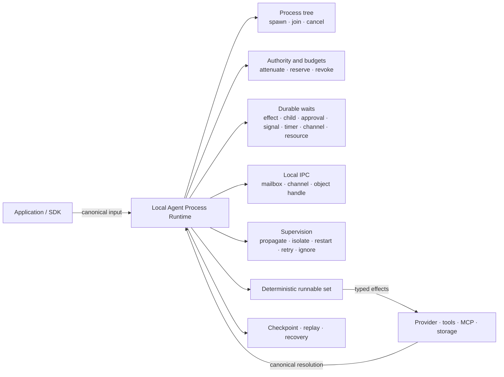

# Agent Process Runtime

DeepStrike's primary capability is a **local Agent Process Runtime**. It treats a root Agent run, child Agents, and workflow nodes as kernel-managed local tasks with explicit semantics for process trees, authority, budgets, waiting, communication, failure handling, and recovery.

“Process” is a runtime concept; it does not require one operating-system process per Agent. Applications keep using the public `RuntimeRunner`, Agent, Workflow, Signal, and Session interfaces. `Tcb`, `WaitSet`, and local IPC are kernel mechanisms behind those interfaces, not replacement user APIs.

## Why a process runtime

A simple Agent loop can perform a model call, but it cannot reliably answer questions such as:

- Who created this task, and how many more children may it create?
- Which capabilities may a child use, and where does its budget come from?
- How is state preserved while waiting for a tool, approval, signal, or another Agent?
- When a child fails, should the parent propagate, isolate, restart, retry, or ignore it?
- After recovery, are scheduling order, wait progress, and IPC still consistent?

The Agent Process Runtime puts these concerns in one inspectable, replayable state machine instead of scattering them across temporary SDK async loops.

## Runtime model

An Operation is the local runtime boundary. The root Agent is the process-tree root. Child Agents and workflow nodes use the same spawn, join, cancel, budget, and supervision semantics. The host executes external effects such as network, model, and tool work; the kernel decides what may run and how state changes.

## Seven core capabilities

| Capability | Runtime semantics | Developer-facing result |
| --- | --- | --- |
| Process tree | Root task, parent-child lineage, spawn, join, and cancel | Sub-Agents and workflow nodes share one lifecycle model |
| Durable waits | `Any` / `All` wait sets cover effects, children, approvals, signals, timers, channels, resources, and external subscriptions | Waiting consumes no runnable slot and survives recovery |
| Authority attenuation | The kernel derives child authority from the actual caller, with capability leases and revocation | A child cannot expand its own authority |
| Hierarchical budgets | Tokens, cost, turns, wall time, child tasks, concurrent children, tool calls, memory writes, and object bytes are reserved and settled down the tree | Total child grants cannot exceed parent remaining budget |
| Local IPC | Point-to-point mailboxes, channel fan-out, and handle-only object descriptors | Agents exchange messages and large-object references without copying unauthorized content |
| Supervision | `Propagate`, `Isolate`, `Restart`, `Retry`, and `Ignore`, with bounded restart/retry attempts | Child failure behavior is predictable and recorded |
| Deterministic scheduling | Root tasks, workflow nodes, waiters, and supervised restarts enter one runnable set | The same canonical input and checkpoint produce stable scheduling choices |

## Non-bypassable invariants

The kernel state transition maintains these constraints rather than relying on caller discipline:

1. A child's parent comes from the actual caller; the host cannot forge lineage.
2. Child capabilities must be equal to or weaker than the parent's currently effective capabilities.
3. Outstanding child budget grants cannot exceed the parent's remaining budget.
4. A waiting task is not runnable and a satisfied condition produces only one effective wake-up.
5. Mailboxes and channels carry messages; reading an object still requires a matching capability.
6. Checkpoints preserve process-tree, wait-progress, budget, IPC, and supervision state so recovery continues the state machine.

External effects use at-least-once delivery semantics. Host integrations should use stable effect IDs or launch tokens for idempotency so recovery or retries do not duplicate side effects.

## Relationship to public capabilities

The Agent Process Runtime is the common foundation of DeepStrike capabilities, not a second product surface parallel to the existing APIs:

| Public capability | Process Runtime foundation |
| --- | --- |
| `RuntimeRunner` | Canonical input, effect resolution, checkpoints, and terminal dispositions |
| Sub-Agents and handoffs | Process trees, authority attenuation, budget reservation, join, and supervision |
| Workflows | Unified runnable set, dependency waits, and node lifecycle |
| Signals and approvals | Durable wait sets and event-driven wake-up |
| Session recovery | Checkpoints, journals, replay, and idempotent effects |
| Governance | Actual caller, capabilities, leases, revocation, and resource boundaries |

This is why DeepStrike does not describe an Agent as merely a prompt workflow. Providers may change and tools may run remotely, while the local runtime continuously maintains Agent identity, authority, resources, and continuity.

## Current boundary

The current implementation focuses on a **single-host, local, durable** Agent Process Runtime. Remote tools, MCP servers, queues, and sandboxes can be attached as host effects, but they do not change ownership of the local process tree.

The current scope does not include distributed worker leases, fencing, task migration, failover takeover, or a cross-node broker. Those capabilities require separate distributed-consistency protocols and cannot be inferred from local checkpoint and replay semantics.

## Where to go next

- [How Agents Run](./index) — the path through one Agent turn
- [Kernel / host split](./overview) — modules and the effect loop
- [Sub-Agents and handoffs](../guides/sub-agents-and-collaboration) — developer use of the process tree
- [Workflows](../guides/workflow) — DAGs and unified scheduling
- [Signals and reactive Agents](../guides/signals-and-reactive) — event-driven wake-up
- [Sessions and recovery](../guides/session-replay-and-recovery) — checkpoints, replay, and recovery
- [Governance and limits](../guides/governance) — capabilities and resource boundaries
