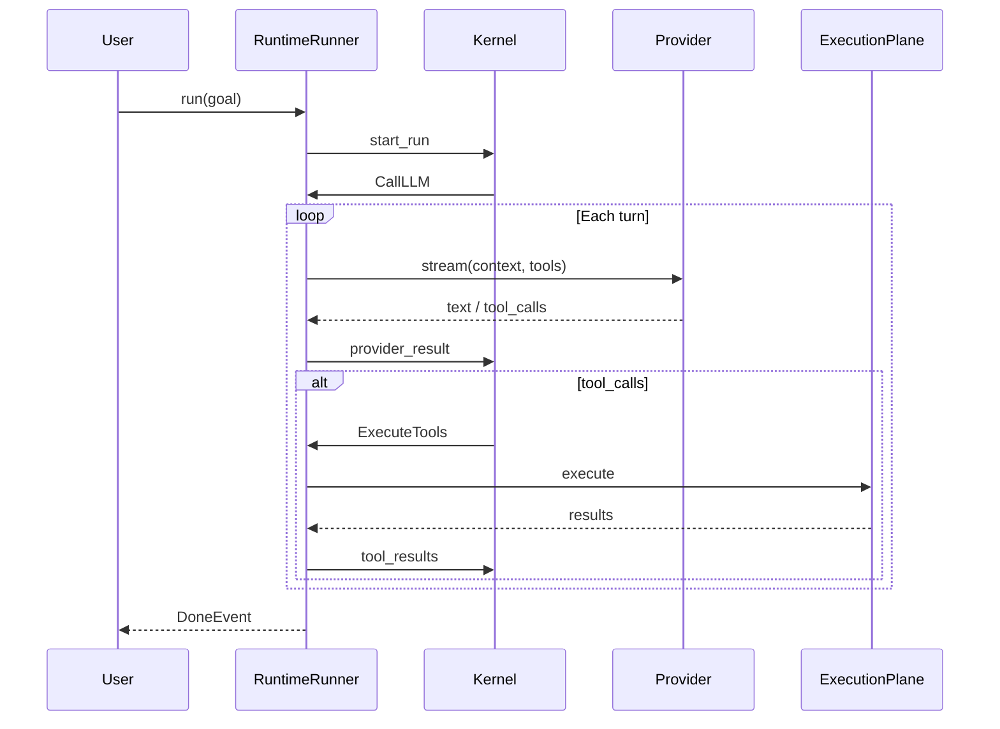

# Execution Model

This page traces **one agent turn** through Agent OS — what the kernel and host each do after the user sends a goal.

## Actors

| Role | Implementation |
|------|----------------|
| **Kernel** | `KernelRuntime` / `LoopStateMachine` |
| **Host** | `RuntimeRunner` |
| **Evidence** | `SessionLog` |

## Lifecycle: start_run → Done




## Phase 1 — Reason

1. `ContextManager` renders `RenderedContext` (four slots)
2. Skill gating + governance **narrow** exposed tools
3. Return `CallLLM`

Kernel decides **what the model sees**; SDK forwards to provider.

## Phase 2 — Act + syscall adjudication

Each tool call → **`Syscall::Invoke`** → `Disposition`:

```text
Invoke(read_file)  →  Allow → ExecuteTools
Invoke(rm_rf)      →  Deny  → error ToolResult in context, not executed
Invoke(deploy)     →  Gate  → Suspended, PermissionRequestEvent
```

Meta-tools (`skill`, `memory`, `submit_workflow_nodes`) handled **inside** the kernel.

## Phase 3 — Observe

Host feeds `ToolResult` / provider text back. History grows; handles register large payloads; pressure sampled.

## Phase 4 — Delta

If pressure exceeds threshold → compression pipeline (Snip → Drop → Summarize), optional renewal, update `frozen_prefix_len`.

## Sub-agent spawn

```text
Syscall::Spawn → quota + trust checks → SDK orchestrator → sub_agent_result → DAG advances
```


## Memory syscalls (outside the tool loop too)

`WriteMemory` / `QueryMemory` go through validation and DreamStore commit/search — never bypass governance. `QueryMemory` hits land in `history` as ordinary turns (single-use, decaying with compaction), not in the durable `knowledge` partition — only skill bodies, `initial_memory`, and host-pinned references live there (see [Context Engineering · Level 5](../guides/context-engineering.md)).

## Suspend & resume

| Reason | State | Resume via |
|--------|-------|------------|
| AskUser | Suspended | permission event |
| Sub-agent | Suspended | sub_agent_result |
| External | Suspended | signal event |

## Further reading

- [Kernel ABI](/en/architecture/kernel-abi)
- [Session & replay](/en/architecture/session-replay)
- [Governance](/en/guides/governance)
