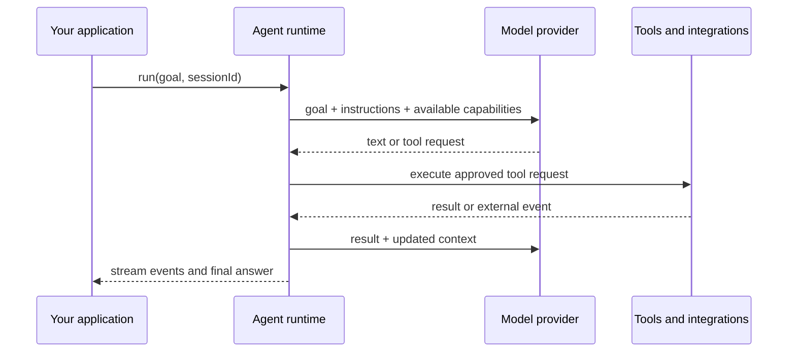

# How Agents Run

DeepStrike gives an Agent a durable working environment around the model call. The Agent receives a goal, decides what it needs, uses the capabilities available to it, and leaves behind enough state to continue later.

## One Agent turn



The application owns the provider and integrations. DeepStrike keeps the Agent's decisions, context, policies, and session state together so a long task does not depend on one fragile process loop.

## What stays with the Agent

| Agent concern | How it is represented |
| --- | --- |
| Identity | Name, instructions, model, tools, skills, memory, knowledge, handoffs, and guardrails |
| Capabilities | Typed tools, MCP servers, provider features, skills, and application integrations |
| Working context | Stable instructions, loaded knowledge, conversation turns, retrieved memory, and current task state |
| Collaboration | Child Agents, roles, isolation, dependencies, contracts, and handoff artifacts |
| Time | Turns, bounded loops, sleep, wake, approvals, signals, and external events |
| Quality | Output schemas, reducers, verifier Agents, evaluation hooks, and milestones |
| Continuity | Session logs, checkpoints, replay fixtures, and recovery after interruption |

## How capabilities compose

Start with one Agent and add only what the task needs:

```text
single Agent
  + tools and provider
  + memory and skills
  + policies and approvals
  + long-running sessions and signals
  + specialist workflows
  + reactive peer team
```

The [Research Brief Studio curriculum](https://github.com/kongusen/deepstrike/tree/main/example) follows this exact progression.

## Runtime boundaries for application developers

Your application still decides where tools run, where durable memory is stored, how approvals are answered, and how billing is calculated. DeepStrike provides the Agent-facing contracts and runtime events needed to make those decisions explicit.

Remote tools, MCP servers, queues, and sandboxes can be connected by the application. They are integrations around the Agent, not a promise that the framework supplies a distributed worker system.

## Further reading

- [Agent capability guides](/en/guides/)
- [Sessions and recovery](/en/guides/session-replay-and-recovery)
- [Implementation reference](./overview)
- [Kernel ABI reference](./kernel-abi)
