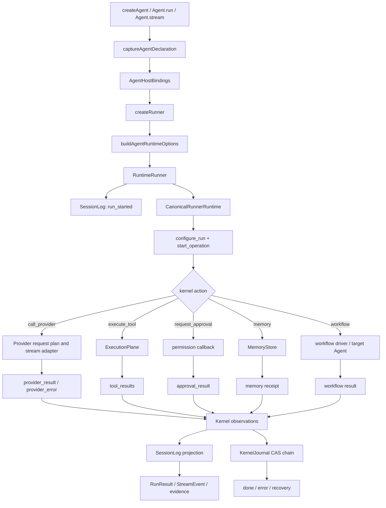

# Complete Node.js SDK Dataflow and Contract Analysis

This document describes the live Node.js SDK execution path, data authority, persistence and recovery relationship, and the type-driven boundary contracts that constrain those paths. The scope is `node/src`, `contracts`, and the Canonical Kernel integration; implementation details for Python, WASM, and Rust SDKs are outside this document.

## Executive conclusion

The Node SDK is an execution system, not a thin “call a provider and return text” wrapper:

1. The public API creates a declaration and a run request.
2. The host binds that declaration into executable `RuntimeOptions`.
3. `RuntimeRunner` projects policy and initial state into the Canonical Kernel.
4. The kernel returns controlled actions; the host performs provider, tool, memory, payload, approval, and workflow side effects.
5. Every side-effect result returns to the kernel with a kernel-minted `effect_id`.
6. The kernel journal is execution truth; `SessionLog` is a business and audit projection.
7. Provider wire data, tool output, and lifecycle events must retain the same run/session/operation correlation for recovery and replay.

The central authority split is:

- **The kernel owns control facts**; the host owns execution and external resources; the provider owns vendor wire semantics.
- **SessionLog is not canonical state**. Recovery must consult `KernelJournal`.
- **Field mappings solve local shape problems only**. Cross-record relations such as effect identity, signal disposal, and run isolation require global invariants.
- **Dynamic workflows use the same `RuntimeRunner` authority**. The VM is a host isolation layer, not an OS-level tenant sandbox.

## 1. Four layers and authority

| Layer | Authority | Node examples | Responsibility |
| --- | --- | --- | --- |
| public | public-agent | `Agent`, `AgentDefinition`, workflow public types | User declarations, intent, input/output types |
| host | host-runtime | `AgentRuntimeImpl`, `RuntimeRunner`, provider adapters, `ExecutionPlane`, MemoryStore | Bindings, external effects, provider and business evidence |
| kernel | canonical kernel | `CanonicalRunnerRuntime`, `CanonicalKernel` | Actions, effects, budgets, context, workflow DAG, terminal and replay facts |
| provider | vendor/provider | Anthropic, OpenAI, Gemini, Ollama adapters | Vendor requests, streams, usage and provider replay data |

These layers collaborate in one Node process but retain different authorities. The host may lower public declarations and execute kernel actions; it must not present host judgments as kernel facts, and provider dialects must not leak directly into the kernel ABI.

## 2. Complete dataflow of an Agent run

### 2.1 Public entry and declaration snapshot

`createAgent()` in `node/src/agent-facade.ts` creates `AgentRuntimeImpl`. Construction calls `captureAgentDeclaration()`, which deep-copies and freezes serializable declaration data while keeping non-serializable execution dependencies in `AgentHostBindings`:

- The declaration contains name, instructions, output schema, skills, knowledge, guardrails, handoffs, provider options, and memory description.
- Host bindings contain the provider, execution plane, session log, memory store/scope, tool functions, vector retrievers, and runtime binding.
- The declaration can be audited, cached, and compared; execution handles and external objects stay out of the snapshot.
- A memory `{kind, namespace, binding}` records declaration and binding state: `runtime` means `memoryStore + memoryScope` are bound, while `declaration` means the agent has only a serializable memory declaration and no runtime store; `remember()`/`recall()` fail immediately at the facade in the latter case. A declaration namespace that disagrees with the runtime scope is rejected during agent creation.

A declaration field has execution semantics only when `buildAgentRuntimeOptions()` maps it and the runner consumes it.

### 2.2 Runner construction and the live lowering

`AgentRuntimeImpl.createRunner()` resolves the provider, prepares MCP or local execution, and calls `buildAgentRuntimeOptions()`. That function is the live public-to-host adapter. It:

- merges declaration and per-run `providerOptions`, with run values winning;
- computes `baselineToolIds` from execution-plane schemas;
- composes instructions and output schema into the system prompt;
- carries max tokens/turns, capability filters, session log, agent id, memory binding, skills, and knowledge;
- merges runtime binding and guardrails without allowing a trailing object spread to overwrite governance;
- wraps the workflow target resolver as a host-side `workflowAgentResolver`.

Old formal IR paths must not be treated as a second runtime authority. The `agent.public-to-host` contract should point to `runtime/agent-runtime-options:buildAgentRuntimeOptions` and tests that exercise the real facade path.

### 2.3 `RuntimeRunner.run()` startup

`RuntimeRunner.run()` reads session history. For interrupted recovery it uses `run_started` and the kernel journal to determine whether a canonical operation is still live. A new run creates a `runId` and appends `run_started`; inherited parent transcript is input to a fresh child operation, never recovery evidence for that child.

`execute()` then:

1. creates `CanonicalRunnerRuntime` bound to `node-operation-${runId}`, the journal, and a payload persister;
2. on a fresh run writes tokenizer, plan-tool state, tool schemas, system prompt, initial memory, skill catalog, stable-core tools, memory/knowledge flags, and milestone contract;
3. seeds provider replay and canonical `preload_history` from session events, loading archives through payload/compression stores;
4. computes `AgentRunSpec`, applying capability filters, allowed-tool ceilings, baseline exposure, and verification contracts;
5. applies governance, context, reliability, signal, and resource-quota policy as a composite `configure_run` input;
6. prefetches long-term memory, seeds attachments, and commits `start_operation` to obtain the first kernel action.

Configuration is not an unstructured options bag. It is lowered into ordered, journaled inputs so recovery can rebuild canonical configuration from the journal/checkpoint rather than trust current host defaults.

## 3. Canonical action loop

The main loop is `execute()` in `node/src/runtime/runner.ts`. Each iteration projects pending observations to SessionLog, handles interrupt and signal input, and processes the current kernel action. The host cannot skip a pending effect and simply finish.

### 3.1 Provider path

For `call_provider`:

1. take the kernel-minted `effectId` and maintain the provider invocation chain;
2. attach tool-output overlays to kernel-rendered context and apply governance schema filtering;
3. build a provider-specific request plan and request fingerprint;
4. reuse a measurement for the same fingerprint or perform native counting/heuristic fallback;
5. reject before transport when the context or trusted measurement exceeds budget, recording a rejected provider attempt and returning a kernel provider error;
6. record `context_prepared` with route and fingerprint;
7. consume the provider stream, yielding text/tool events while accumulating usage in host state;
8. record transport errors as provider attempts and let the kernel choose retry or terminal behavior;
9. on success, construct the assistant message and settled token counts, record provider evidence, commit `provider_result`, and append `llm_completed`.

The provider contract surface is request planning, usage normalization/settlement, and stream decode/finish. Vendor wire dialects remain inside their adapters.

### 3.2 Tool and execution-plane path

For `execute_tool`, the host records `tool_requested`, builds a `RunContext`, and calls `ExecutionPlane.executeAll()` for ordinary tools.

- Kernel syscalls such as `update_plan` are projected back to the kernel.
- Every call receives exactly one tool result.
- Schema validation can produce `tool_argument_repaired` or a failed result.
- `onToolCall` is a host veto; blocked calls never execute.
- Permission requests are centralized and default to deny without a handler.
- `onToolResult` may replace output or inject a note before the kernel/session projection.
- Rich tool output goes both to a turn-local overlay and durable session evidence.
- The host commits `tool_results(effect_id, results[])`; the kernel chooses the next action.

The execution plane owns tool functions and credentials. The kernel decides which calls are allowed and how results are consumed.

### 3.3 Approval path

`request_approval` is a kernel effect. The runner emits SDK permission events and SessionLog requested/resolved events, resolves each request, records denial evidence when necessary, and returns approved/denied call IDs in one `approval_result` input.

The approval effect must both retain its `effect_id` in denial evidence and be resolved by a kernel input. A UI event alone cannot complete the effect.

### 3.4 Memory path

`persist_memory` and `query_memory` are kernel actions. The host uses `memoryScope` and `agentId` to call MemoryStore, marks model-originated records as untrusted, and returns a memory receipt or query result to the kernel. Facade `remember()`/`recall()` use the same runner memory path, so governance, audit, and persistence remain aligned.

Memory content is owned by the host store; the kernel owns effect and receipt projections. Provenance is assigned at the crossing path and cannot be self-declared by model output.

### 3.5 Workflow and dynamic workflow path

`spawn_workflow` enters the workflow driver. The driver handles batches, dependency outputs, reducers, loops, tournaments, output schemas, child budgets, and target resolution. A target Agent is resolved on the host boundary and supplies its own provider and bindings.

Dynamic workflows use `RuntimeRunner.runDynamicWorkflow()` as the only public execution entry:

- functions, `DynamicWorkflowScript`, and `DynamicWorkflowArtifact` all enter the same method;
- scripts run in a restricted `node:vm` context with injected host APIs such as `agent`, `parallel`, `pipeline`, `phase`, and `log`;
- the controller submits work to the same kernel workflow root and returns child outcomes to the script;
- artifact digest, args, limits, lifecycle events, and invocation records bind to the replay store;
- approval, cancellation, failure, and completion close the same root operation.

Dynamic scripts expose an explicit `trust: "trusted" | "untrusted"` policy. Trusted scripts enter the restricted `node:vm`; untrusted scripts run in a separate child process plus child VM and request host workflow operations over JSON-RPC. Both paths reject filesystem, shell, network, module-loading, dynamic-code-generation, and nondeterministic time/random capabilities. The child process is killable and has a minimal environment, but it is still not a container or OS policy sandbox.

## 4. Kernel journal and SessionLog

### 4.1 KernelJournal is canonical execution state

`CanonicalKernelHost.transition()` performs prepare, CAS append, and commit for each input. Journal records contain canonical bytes, digests, operation identity, and `step_seq`; CAS conflicts, integrity failures, and IO errors have distinct error classes.

`CanonicalRunnerRuntime.restore()` rebuilds kernel state and pending effects from the journal/checkpoint. Kernel IDs are minted by the kernel; OperationId is proposed by the host and bound on the first accepted input; provider CallId may be adopted from a provider; digests and request fingerprints are content-addressed.

### 4.2 SessionLog is a business projection

SessionLog has an independent `seq` space and stores run, provider, prompt/context, tool/permission, memory, workflow, signal, budget, lifecycle, and terminal events. It serves SDK results, audit queries, dashboards, replay input, and memory extraction.

It must not independently decide whether an operation is terminal, replace journal causality, or mint kernel identity. `appendObservations()` uses `kernelObservation.to-session-event`; intentionally dropped bookkeeping must be declared in the protocol.

## 5. Replay, resume, and failure

Normal resume reads session events, locates `run_started`, verifies the canonical journal head, restores the kernel, and continues from its pending effect. Provider replay reuses measurement/evidence only when the request fingerprint matches.

Dynamic replay additionally binds run ID, artifact digest, argument fingerprint, limits, lifecycle sequence, and invocation fingerprints. Only completed or completed-partial records are reusable; failed and cancelled tails remain diagnostic.

Every failure has a terminal path: provider errors are adjudicated by the kernel, unhandled actions fail closed, and dynamic script/child failures commit cancellation/preemption before host state is cleared.

## 6. Contract mechanism

### 6.1 Registry and protocol families

`contracts/protocols/registry.ts` is the source of truth. It currently registers 15 protocol families covering public-to-host lowering, host-to-kernel projections for capabilities/configuration/memory/skills/signals/workflows, kernel-to-host observation/workflow actions, and provider request/stream/finish/usage crossings.

Each `BoundaryProtocol` declares endpoints and authority, family/direction, preserves/renames/drops/derived/forbidden fields, nested/envelope mappings, lazy semantics, lossiness, validation mode, and test references.

Multiple adapters are intentional: capabilities, configure-run, provider families, and workflows are families of related crossings rather than single functions.

### 6.2 What the checker proves

`scripts/check-boundary-contracts.mjs` parses the registry, expands adapter families, builds the TypeScript program, resolves adapter source and return types, checks explicit mappings and nested paths, infers preserves/drops, and generates manifests and validators. `--verify` rejects stale or hand-edited artifacts.

Nested mappings are path-aware, including arrays. The checker proves that paths and types exist; it does not prove that every runtime value is semantically mapped.

Generated validators can enforce forbidden fields, lazy-field policy, required preserved fields, basic runtime shapes, and strict unknown-field rejection. `behavioral-tests` requires test references with selectors; the checker verifies that each file exists, contains tests, and still contains the selected suite/test identifier, but execution and review are still needed to prove semantic branch coverage.

### 6.3 Global relational invariants

`contracts/invariants.ts` records relations that field policies cannot express:

| Invariant | Rule | Enforcement |
| --- | --- | --- |
| effect-id-kernel-minted | Host evidence effect IDs must reference kernel pending effects; hosts never mint replacements | Canonical Kernel + SessionLog |
| signal-disposal-one-to-one | Each `(delivery_id, attempt)` has exactly one disposal receipt before ack/nack | signal drain + kernel |
| run-context-isolation | Evidence, background work, and callbacks retain run/session identity; cross-operation receipts cannot resolve the current effect | OperationContext + SessionLog |

These relational rules complement, rather than replace, per-adapter field policies.

## 7. Strengths and remaining limits

The current Node backbone is coherent: the facade, runner, kernel, provider, tools, memory, workflow, and dynamic workflow use one execution authority; `buildAgentRuntimeOptions()` is the live lowering; session runners are isolated by session; handoff resolves the target Agent; provider adapters and generated manifests are registered; and dynamic workflows share kernel/journal/approval/lifecycle/replay semantics.

Remaining validation boundaries are:

1. VM isolation is not OS-level sandboxing.
2. Declaration memory and runtime memory bindings must remain explicitly aligned.
3. Workflow target metadata, provider options, approval, and evidence must remain tied to child runs.
4. Contract checking prevents type and artifact drift but cannot replace end-to-end behavior tests or prove replay causality from manifests alone.
5. Artifact digest, approval resolution, lifecycle, and payload digest correlations may need additional global invariants as the system grows.
6. `VERSION`, `node/package.json`, and generated manifests must be sourced from one canonical version before release.

## 8. Verification order for Node changes

For every execution-semantic change:

1. add a failing test through the real public facade path;
2. verify adapter source/target types and field policy;
3. run `npm run contracts:check`;
4. run `npm run contracts:verify`;
5. run focused Node tests and then `npm test -- --runInBand`;
6. exercise journal/replay for resume, provider failure, tool denial, approval, signal, memory, and workflow;
7. run `npm run docs:drift`.

This separates type correctness, live consumption, relational correctness, and replayability instead of treating a green TypeScript build as proof that the architecture is closed.
