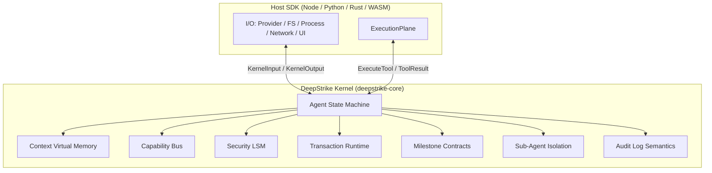

# DeepStrike Agent OS Kernel — 实施规划

## 北极星

**DeepStrike Kernel = Agent OS 微内核**

| 层 | 职责 | 不做 |
|---|---|---|
| **Kernel** | 状态机、context VM、capability bus、syscall 治理、transaction/rollback、checkpoint/replay/recovery、milestone contract、audit 语义、multi-agent 隔离契约、Host SDK ABI | 直接 I/O |
| **SDK** | Provider、文件系统、进程、网络、UI、人类审批；执行 kernel 发出的 action，把外部事件喂回 kernel | 发明 runtime 行为 |

**不变原则：** Kernel owns agent semantics. SDK owns host effects.

Kernel 不直接做 I/O，但要定义并维护：

- agent 的运行状态机
- context 虚拟内存管理
- capability bus
- syscall/tool governance
- transaction / rollback
- checkpoint / replay / recovery
- milestone contract
- audit log semantics
- multi-agent isolation contract
- host SDK ABI

SDK 不再「发明 runtime 行为」，SDK 只执行 kernel 发出的 action，并把外部事件喂回 kernel。

---

## 架构演进

```
+-----------------------------------------------------------------------------------+
| V1 模式 (已废弃): 外部工具库                                                       |
|   - SDK 自行调度 Loop, 自己渲染上下文                                             |
|   - Hook/拦截器散落在 SDK 层，执行流缺乏确定性                                    |
|   - SessionLog 仅作为聊天记录归档                                                  |
+-----------------------------------------------------------------------------------+
                                         │
                                         ▼
+-----------------------------------------------------------------------------------+
| V2 模式: Agent OS 微内核                                                          |
|   - Runtime 成为唯一的总控制核心 (Core Control Plane)                              |
|   - Loop, Context, Governance, 权限审批, GC 都在内核中自治                         |
|   - SDK 弱化为「宿主 I/O 设备驱动器」，通过 Kernel ABI 交互                        |
+-----------------------------------------------------------------------------------+
```

### 架构总览



### Kernel ABI（目标形态）

```
KernelInput:
  StartRun
  ProviderResult
  ToolResult
  Signal
  PermissionDecision
  MilestoneResult
  CapabilityCommand
  Timeout

KernelOutput:
  CallProvider
  ExecuteTool
  RequestPermission
  EvaluateMilestone
  EmitAuditEvent
  Done
```

---

## 当前基线 vs 目标差距

| 领域 | 已有 | 缺口 |
|---|---|---|
| Milestone | `MilestoneContract`、state machine 集成、`MilestonePolicy` 默认 pending、Node/Python/WASM 接 `EvaluateMilestone`、四端 audit 事件 | 缺外部 verifier hook 与 evidence audit |
| Rollback | `LoopObservation::Rollbacked`、replay 截断、fatal-only rollback、recoverable error 保留 history | 缺 `ToolErrorKind` 一等分类与 transaction audit |
| Capability | `CapabilityManifest`、`CapabilityChanged`、运行时 mount/unmount | 无 Pin/Lease 一等命令 |
| Context VM | `ContextSectionRegistry`、6 分区、pin/cache policy | 缺 `ContextPage` / `ContextFault` / Artifacts 分区 |
| LSM | `ToolDecisionPipeline`、monotonic veto、四端 `ToolDenied` audit/stream event | 未标准化全链路 stage vocabulary |
| Kernel ABI | `LoopAction` / `LoopEvent` / `LoopObservation` 内聚在 core；`KernelInput` / `KernelAction` / `KernelObservation` + `KernelRuntime.step()` 已落地；Rust/Node/Python/WASM runner 已迁入 step 驱动；Node/PyO3/WASM 旧 runtime facade 已移除 | 长期 JSON/强类型 ABI 策略待收口；仍需补 golden fixture 防字段漂移 |
| Skill sandbox | Rust `sandboxed_skill`、watcher、Node/Python watcher、process sandbox 文案校正 | 资源策略仍是 hygiene，不是 OS-enforced sandbox |

---

## 进度快照

| 项 | 状态 | 提交 / 证据 |
|---|---|---|
| Phase 0 / PR 1：V2 收口 | ✅ 已完成 | `68c7496 feat(kernel): add agent OS v2 runtime primitives` |
| PR 1 文档规划 | ✅ 已完成 | `6e1fecd docs: plan agent OS kernel roadmap` |
| G0 — V2 Mergeable | ✅ 已通过 | `cargo check --workspace`、`cargo test -p deepstrike-core`、`cargo test --manifest-path rust/Cargo.toml`、Node/WASM build + targeted tests、Python targeted tests |
| Phase 1 / PR 2：Kernel ABI 固化 | ✅ 已完成 | `b84af51 test(abi): add golden fixtures and confirm JSON ABI as long-term FFI boundary` — JSON ABI 冻结，四端 golden fixture CI 全绿，spec-kernel-abi.md 更新完毕 |
| Phase 2 / PR 3：Virtual Context Memory | ✅ 已完成 | 6 分区 VM，ContextSnapshot，ArchiveStore，reconstruct_messages_with_fallback，PushArtifact，spec-context-compression-v2.md Phase A+B+C |
| Phase 3 / PR 4：Capability Bus | ✅ 已完成 | `6be8003 feat(p3): add mounted_by/mount_reason provenance to capability bus` — CapabilityCommand::Mount provenance，lease 自动 revoke，四端 CapabilityChanged audit，unlocked_by_milestone_id 延至 Phase 6 |

**当前主线：** Phase 3（Capability Bus）已完成（`6be8003`）。Capability provenance（mounted_by / mount_reason）全链路，lease 自动 revoke，四端 audit 一致。**下一步：Phase 4 — Security LSM。**

**Phase 1 最新提交链：**

| 提交 | 内容 |
|---|---|
| `e18c2cf` | 定义 versioned `KernelInput` / `KernelAction` / `KernelObservation` |
| `808e4a8` | Node/PyO3/WASM 暴露 `KernelRuntime.step()` JSON ABI |
| `9d1b0df` | setup/config 事件接入 kernel ABI |
| `95412d2` | task update / tokenizer 等运行时更新接入 kernel ABI |
| `736a5a8` | Rust SDK runner 迁入 `KernelRuntime.step()` |
| `d087ca1` / `8695f35` | Node 读侧 helper + runner 迁移 |
| `571d3f3` / `9f3d867` | Python 读侧 helper + runner 迁移 |
| `d014065` | WASM 读侧 helper + runner 迁移，补 413 reactive compact retry |
| `91e0fc5` | 清理 Node/PyO3/WASM 旧 runtime facade 与专用 `LoopAction` / `LoopObservation` wrapper |
| untracked | 四端 golden fixture：`tests/fixtures/abi/`（6 文件）+ `t12_golden_fixtures.rs` + node/python/wasm test files |

## 阶段规划

### 阶段 0：V2 收口（可合并态）

**状态：✅ 已完成。**

**必须先做，不然上层规划会漂。**

**目标：** 全端编译闭环 + 策略语义正确 + 测试全绿。

**范围：**

1. **FFI exhaustive match 闭环**
   - `EvaluateMilestone`、`CapabilityChanged`、`MilestoneAdvanced`、`MilestoneBlocked` 在 Node / WASM / PyO3 全端 match
   - `cargo check --workspace` 零遗漏

2. **Rust SDK 审计链补齐**
   - 补 `ToolDenied` streaming event，与 Node/Python `execution_plane` 一致

3. **Milestone 策略显式化**
   - 去掉 Rust runner 中 `MilestoneCheckResult::pass()` 默认 auto-advance
   - 引入 `MilestonePolicy`（或等价配置）：`RequireVerifier`（默认）/ `AutoPass`（显式 opt-in）
   - SDK 收到 `EvaluateMilestone` → 执行 verifier → 回传 `MilestoneResult`

4. **Rollback 语义收紧**
   - `LoopEvent::ToolResults`：仅 `fatal` / `transactional` error 触发 rollback
   - 普通 recoverable tool error 写入 history，供模型修正
   - 引入 `ToolErrorKind { Recoverable, Fatal, GovernanceDenied, ... }`
   - 同步更新 `test_context_rollback_on_tool_failure_*` 测试预期

5. **Python skill sandbox 收口**
   - 降级命名（或补 timeout / unique workdir / resource policy）

**验收：**

```bash
cargo check --workspace
cargo test -p deepstrike-core
cargo test --manifest-path rust/Cargo.toml
# Node / Python targeted tests
```

**交付物：** `68c7496 feat(kernel): add agent OS v2 runtime primitives`

---

### 阶段 1：Kernel ABI 固化

**状态：✅ 已完成。**

**目标：** SDK 不再直接操作 `LoopStateMachine` 细节。

**设计：**

| 类型 | 职责 |
|---|---|
| `KernelInput` | SDK → Kernel 的所有观测 |
| `KernelAction` | Kernel → SDK 的所有副作用请求 |
| `KernelObservation` | Kernel 内部状态变化（audit 源） |
| `KernelRuntime` | 唯一入口：`step(input) -> Vec<KernelAction>` |

**任务：**

1. [x] 在 `deepstrike-core` 定义稳定 ABI 类型（serde + 版本字段）
2. [x] 增加 `KernelRuntime::step(KernelInput) -> KernelStep` 薄包装，保持现有行为不变
3. [x] Node / Python / WASM 绑定暴露 `KernelRuntime.step(input_json) -> step_json`
4. [x] 文档：`docs/spec-kernel-abi.md`
5. [x] config / preload / capability / milestone setup 纳入 `KernelInputEvent`
6. [x] tokenizer / task-state update 纳入 `KernelInputEvent`
7. [x] `RuntimeRunner` 重构为 input/action 驱动，不再散落 `sm.feed(...)` 细节（Rust/Node/Python/WASM SDK 已完成）
8. [x] FFI 默认入口收口到 `KernelRuntime`，隐藏 `LoopStateMachine` / `ContextManager`（Node/PyO3/WASM `KernelRuntime` 读侧 helper 已补齐，旧 facade 已移除）
9. [ ] Node / Python / WASM 绑定从 JSON ABI 过渡到强类型 API（或确认 JSON ABI 作为长期 FFI 边界）

**已验证：**

```bash
cargo check --workspace
npm run build        # node
npm test             # node
npm run build        # wasm
npm test             # wasm
PYTHONPATH=/Users/shan/work/uploads/deepstrike/python poetry run pytest -q
```

**剩余收口任务：**

1. [x] 明确旧 `DeepStrikeRuntime` / `LoopStateMachine` FFI：Node/PyO3/WASM public facade 删除（`91e0fc5`），core 白盒测试继续直接测内部状态机。
2. [ ] 确认 JSON ABI 作为长期跨语言边界（当前三端 FFI 均已 `step(String) -> String`，建议直接冻结），更新 `spec-kernel-abi.md` 中 schema 版本策略。
3. [x] 为 `KernelInput` / `KernelAction` / `KernelObservation` 增加四端 golden fixture（`tests/fixtures/abi/` 6 文件 + Rust t12 + Node/Python/WASM 测试文件已写，**untracked，待提交并跑通四端 CI**）。
4. [ ] 更新 SDK public docs，明确 SDK 是 host effect driver，不再持有 runtime semantics。

**验收：**

- 四个 SDK 仅通过 `KernelInput` / `KernelAction` 交互
- 无 breaking 内部类型泄漏到 public FFI
- 现有 integration tests 迁移后仍绿

**交付物：** `refactor: introduce kernel input/output contract`

**依赖：** 阶段 0

---

### 阶段 2：Virtual Context Memory

**目标：** Context 是虚拟内存，不是字符串拼接器。

**核心能力：**

- section registry
- pinned sections
- compression policy
- renewal / handoff
- provider prompt cache hint
- replay recovery repair
- archive store contract

**分区 VM Contract：**

| 分区 | 策略 | 失效 |
|---|---|---|
| System | immutable / static cache | Never |
| Skill | session cached | OnSkillChange |
| Memory | dynamic retrieved / bounded | OnMemoryRefresh |
| Working | volatile signal buffer | EveryTurn |
| History | compressible / archival | OnCompact |
| Artifacts | referenced, not inlined | — |

**新增类型：**

- `ContextPage`
- `ContextSnapshot`
- `ContextArchiveRef`
- `ContextGcPolicy`
- `ContextFault`（prompt too long、missing archive、invalid replay）

**任务：**

1. 补 `Artifacts` 分区到 registry
2. `ContextSnapshot` + provider prompt cache hint 确定性 hash
3. replay recovery repair：archive 缺失 / 截断修复路径
4. `ContextFault` → kernel 可恢复错误，写入 audit

**验收：**

- 压缩/GC 按 section policy 执行，pinned section 豁免
- replay 可从 snapshot + archive ref 重建 context
- `spec-context-compression-v2.md` 与实现一致

**依赖：** 阶段 1（ABI 承载 context 事件）

---

### 阶段 3：Capability Bus

**状态：✅ 已完成（`6be8003`）。**

**目标：** 能力是 kernel 管理的 runtime capability graph，不是 tool list。

**能力类型：** tool / skill / memory / knowledge / command / mcp server / sub-agent / sandbox profile / credential scope / milestone unlock

**命令：**

```text
CapabilityCommand::Mount   ← mounted_by / mount_reason provenance ✅
CapabilityCommand::Unmount ✅
CapabilityCommand::Replace ✅
CapabilityCommand::Pin     ✅
```

**已完成：**

- [x] `CapabilityCommand` 作为 `KernelInput` 变体
- [x] `CapabilityChanged` audit 含 change_kind / capability_id / version
- [x] capability lease + 自动 revoke（turn-based expiry，feed() 自动 unmount）
- [x] capability provenance：`mounted_by` / `mount_reason` on `CapabilityDescriptor`、`CapabilityCommand::Mount`、`LoopObservation`、`KernelObservation`、`SessionEvent`，四端 runner 全部透传
- [x] Sub-agent capability filter（`AgentCapabilityFilter` + `AgentRunSpec`）

**延迟项：**

- `unlocked_by_milestone_id`：需要 Phase 6 Milestone Contracts 作前提，届时在 `CapabilityDescriptor` 上补充

**验收：**

- ✅ 特权漂移全链路可审计（provenance 字段全覆盖）
- ✅ milestone unlock → capability mount 有 provenance（unlocked_by_milestone_id 延至 Phase 6）
- ✅ replay 可重建 effective capability manifest
- ✅ 177 Rust 测试全绿（`6be8003`）

**依赖：** 阶段 1

---

### 阶段 4：Security LSM

**目标：** 工具调用 = syscall，必须过 LSM。

**治理链路：**

```
Classify
  -> CapabilityCheck
  -> ConstraintCheck
  -> PermissionCheck
  -> VetoCheck
  -> RateLimit
  -> SandboxPolicy
  -> Audit
```

**不变量：**

- deny monotonic
- permission allow 不能绕过 veto
- hook 只能收紧，不能放宽
- 所有 denial 必须写审计日志
- 所有 ask-user 必须可恢复

**交付物：**

- `ToolDecisionPipeline`
- `ToolDecisionStage`
- `ToolDenied`
- `PermissionRequested`
- `PermissionResolved`
- `SandboxProfile`
- `SecurityPolicySnapshot`

**验收：**

- 任一 stage deny 后后续 stage 不可 overwrite
- 四端 `ToolDenied` audit 一致
- replay 可恢复 pending permission 流

**依赖：** 阶段 3（capability check 需要 bus）

---

### 阶段 5：Transaction Runtime

**目标：** Turn 级原子事务，rollback 精确可控。这块会决定 DeepStrike 是否真的像 OS。

**TurnTransaction API：**

```
checkpoint()
apply_llm_message()
apply_tool_results()
commit()
rollback(reason)
```

**Rollback 触发（仅 fatal / inconsistent）：**

| 原因 | Rollback? |
|---|---|
| recoverable tool error | 否 — 保留 history |
| fatal tool error | 是 |
| governance denied | 视策略 |
| provider failure | 是 |
| malformed replay | 是 |
| timeout / user interrupt | 是 |

只有 fatal / inconsistent state 才 rollback。普通 tool error 应保留在历史里，让模型修正。

**交付物：**

- `TurnCheckpoint`
- `RollbackReason`
- `ToolErrorKind`
- `TransactionObservation`
- replay 按 rollback event 精确截断

**验收：**

- 普通 tool error 不丢 turn 上下文
- fatal error 恢复到 checkpoint
- audit log 可完整 replay transaction 边界

**依赖：** 阶段 0（rollback 语义）+ 阶段 4（governance denied 分类）

**交付物 PR：** `feat: make milestone and rollback policy explicit`（与阶段 0 第 3–4 项合并）

---

### 阶段 6：Milestone Contracts

**目标：** 从「聊天 agent」升级为「工程 agent」。Milestone 是 DeepStrike 的关键差异化。

**MilestoneContract 完整形态：**

```
phase_id
criteria
verifier
required_evidence
unlock_capabilities
rollback_policy
retry_policy
```

**Verifier 类型（显式配置，默认无 auto-pass）：**

- machine check
- harness eval
- LLM judge
- human approval
- external CI/test command

**KernelOutput：** `EvaluateMilestone`

**Audit：** `MilestoneAdvanced` / `MilestoneBlocked` / `MilestoneEvidence`

**交付物：**

- `MilestoneVerifier`
- `EvaluateMilestone`
- `MilestoneAdvanced`
- `MilestoneBlocked`
- `MilestoneEvidence`
- `MilestoneUnlockPolicy`

**验收：**

- 默认 milestone 必须经 verifier 才能 advance
- blocked → retry policy 可控
- unlock capabilities 带 provenance（接阶段 3）

**依赖：** 阶段 0 + 阶段 3 + 阶段 5

---

### 阶段 7：Sub-Agent Isolation

**目标：** 多 agent 差异是 kernel contract，不是 prompt 建议。

**一等抽象 `AgentRunSpec`：**

- role
- isolation mode
- capability filter
- context inheritance
- memory scope
- permission profile
- workspace / sandbox profile
- parent-child audit lineage

**典型角色：** explore / implement / verify / plan — 各走不同 isolation + capability filter

**验收：**

- sub-agent spawn 自动生成隔离 manifest
- parent-child audit lineage 可追踪
- replay 可独立恢复 sub-agent run

**依赖：** 阶段 3 + 阶段 4 + 阶段 6

---

## 近期执行顺序（3 个 PR 栈）

| 顺序 | PR | 核心内容 | 解锁 |
|---|---|---|---|
| **1** | `fix: close V2 ABI gaps` | FFI match、Rust ToolDenied、milestone 去 auto-pass、rollback fatal-only、Python sandbox | 可合并 V2 |
| **2** | `refactor: introduce kernel input/output contract` | KernelInput/Action/Observation、KernelRuntime、FFI 收口 | SDK 边界清晰 |
| **3** | `feat: make milestone and rollback policy explicit` | MilestonePolicy、ToolErrorKind、TurnTransaction 雏形、transaction audit | 工程 agent 语义 |

PR 1 与 PR 3 有重叠（milestone/rollback），可按实际 diff 大小拆分或合并为一个 stack 的两个 commit。

三步做完，DeepStrike 的主线会非常清晰：**Kernel owns agent semantics. SDK owns host effects.**

---

## PR 1 任务清单（阶段 0 细化）

### 1.1 FFI match 闭环

- [x] `crates/deepstrike-node/src/lib.rs` — 补 4 个 observation variant
- [x] `crates/deepstrike-wasm/src/lib.rs` — 同上
- [x] `crates/deepstrike-py/src/lib.rs` — 同上 + Python 类型导出
- [x] `node/src/runtime/runner.ts` — 处理 milestone/capability observations
- [x] `python/deepstrike/runtime/runner.py` — 同上
- [x] `wasm/src/runtime/runner.ts` — 同上

### 1.2 Rust ToolDenied

- [x] `rust/src/runtime/execution_plane.rs` — yield `ToolDeniedEvent`
- [x] `rust/src/run_event.rs` — 事件类型
- [x] `rust/src/runtime/runner.rs` — audit → `SessionEvent::ToolDenied`

### 1.3 Milestone 显式策略

- [x] 删除 `runner.rs` auto-pass
- [x] 新增 `MilestonePolicy`（core 或 runner opts）
- [x] Node/Python/WASM runner：`EvaluateMilestone` → 默认 `milestone_pending`
- [x] 更新 `tests/rust/src/t11_runtime.rs`

### 1.4 Rollback 收紧

- [x] `state_machine.rs` — `ToolResults` 分支仅 `is_fatal` rollback
- [x] 更新 rollback/replay 测试（Rust / Node / Python）
- [ ] 后续 PR 3：补 `ToolErrorKind` 与 transaction audit

### 1.5 Python sandbox

- [x] `python/deepstrike/skills/watcher.py` + execution — watcher / subprocess hygiene
- [ ] 后续：明确 timeout / unique workdir / resource policy 是否升级为 OS sandbox

---

## 成功指标（各阶段 Gate）

| Gate | 条件 |
|---|---|
| **G0 — V2 Mergeable** | workspace compile + core/SDK tests 全绿；无默认 auto-pass；rollback 仅 fatal |
| **G1 — ABI Stable** | ✅ 四端仅 KernelInput/Output；FFI 无内部结构泄漏；golden fixture 四端 CI 通过；JSON ABI schema 已冻结 |
| **G2 — Context VM** | ✅ 6 分区 + fault + replay repair 测试通过 |
| **G3 — Capability Bus** | ✅ mount/unmount/lease audit 完整；provenance 四端透传；unlocked_by_milestone_id 延至 Phase 6 |
| **G4 — LSM** | deny monotonic 测试 + 四端 ToolDenied 一致 |
| **G5 — Transaction** | recoverable error 不 rollback；replay 精确截断 |
| **G6 — Milestone** | verifier 驱动 phase advance；blocked retry 可控 |
| **G7 — Multi-Agent** | sub-agent isolation + lineage replay |

---

## 文档同步

| 文档 | 动作 |
|---|---|
| `docs/implementation-agent-os-kernel.md` | 本文档 — 主规划 |
| `docs/spec-kernel-abi.md` | 阶段 1 新建 |
| `docs/spec-runtime-v2-lifecycle.md` | 补 milestone / rollback / capability 事件 |
| `docs/spec-context-compression-v2.md` | 阶段 2 对齐 VM contract |

---

## 风险与消减

| 风险 | 消减 |
|---|---|
| 去 auto-pass 破坏现有 demo/测试 | 测试显式传 `MilestonePolicy::AutoPass` 或 mock verifier |
| rollback 语义变更影响 replay | 先加 `ToolErrorKind`，replay 按新 event 截断，保留 migration note |
| ABI 重构 diff 大 | PR 2 只做类型抽取 + runner 薄封装，不改行为 |
| 四端不同步 | 每个 PR 要求四端同 PR 或同 stack 合并 |
| 不再向后兼容导致已有测试失效 | 在 `crates/deepstrike-core` 中直接开辟 V2 内核，SDK 端全面适配，删除历史废代码 |
| 宿主资源管理泄漏 | Runtime 退出时严格调用 `CleanupCompleted` 事件并执行系统级清理钩子 |

---

## 核心内核抽象（长期沉淀）

为支撑 Agent OS Runtime 控制流，内核沉淀以下一等公民抽象：

### 1. CapabilityManifest（能力清单）

**定位：** OS 能力特权表 (Capability Table)。

**职责：** 将工具、Skills、Memory、Knowledge、MCP Server、内置指令、子 Agent 能力统一注册到一个单一的 Manifest 中。模型能干什么不再散落在各处，而是由 Kernel 进行严格审计、过滤和排序的唯一 SSOT。

### 2. ContextSectionRegistry（虚拟内存段表）

**定位：** 内存虚拟地址空间表 (VMM Segment Table)。

**职责：** 上下文被拆分为具有独立生存策略的虚拟 Section（system, skill, memory, history, working, artifacts 等）。每个 section 包含优先级、缓存策略、失效规则和 Token 预算。

### 3. ToolDecisionPipeline（内核安全系统调用过滤管线）

**定位：** 内核安全过滤模块 (SELinux / Linux Security Module)。

**职责：** 所有工具调用本质上是「系统调用 (System Call)」。Runtime 强制通过 classifier, hook, permission, veto, rate limit, constraint, audit 管线。遵循**单调性原则**：一旦被前置安全策略 Deny，任何后置 Hook 均无权 Overwrite。

### 4. AgentRunSpec（进程运行规格）

**定位：** 进程运行规格 (Process Run Spec)。

**职责：** 子 Agent 的角色（explore / implement / verify / plan）、隔离度、目标（goal）、验证契约（verification contract）、动态能力过滤器均封装成一等进程规范，支持多级 Agent 的生命周期追踪。

### 5. ContextSnapshotHint（缓存哈希指示器）

**定位：** OS 提示页缓存 (Prompt Cache Hint)。

**职责：** 为 LLM 缓存页提供确定性 Hash 策略（如静态系统前缀、活动能力清单指纹）。宿主 SDK 基于此 Hash 稳定维护 LLM API 的 prompt cache 边界。

### 6. Unified SessionEvent Vocabulary（内核事件审计日志）

**定位：** 内核审计事件总线 (Kernel Audit Event Log)。

**职责：** 将整个 Runtime 周期内的推理执行、权限审批挂起、动态能力变化、处理挂起与垃圾回收 (GC) 统一为一个结构化、可重放的事件流。
