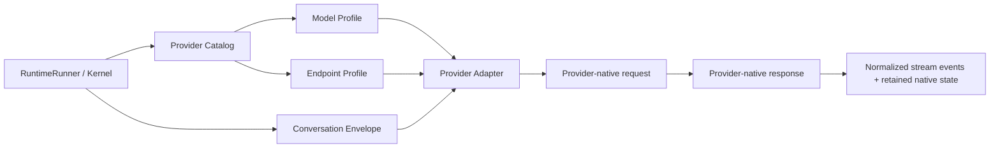

# Spec: Node Provider Native Profiles

## Objective

Upgrade the Node provider layer from “call-compatible wrappers” into a capability source the rest of DeepStrike can trust.

The Node SDK should describe three distinct concerns:

1. **Provider Adapter** — how to speak a provider family’s wire protocol.
2. **Endpoint Profile** — which endpoint family/base URL/version is being targeted.
3. **Model Profile** — what an individual model can do and which conversation semantics it requires.

This lets the framework, not application code, own:

- endpoint selection
- provider/model capability discovery
- provider-native message serialization
- thinking/tool-call round-trip rules
- multimodal and reasoning constraints

The first implementation target is **MiniMax**, because the current Node SDK still models the old `api.minimax.chat` / `MiniMax-M1` shape while current MiniMax docs center the newer M2.x family and document both Anthropic-compatible and OpenAI-compatible access paths under `api.minimaxi.com`. MiniMax also makes the missing abstraction obvious: interleaved thinking only works when the complete assistant response is preserved in history across tool-use turns.

## Source-verified facts that shape the design

- MiniMax’s current text generation docs list the M2.x family, state that text generation supports tool calls, and document SDK access via Anthropic SDK or OpenAI SDK.
- MiniMax’s current tool-use guide says M2.7 natively supports interleaved thinking and requires the **complete** assistant response to be appended to message history during multi-round function calling; for OpenAI-compatible usage it documents `OPENAI_BASE_URL=https://api.minimaxi.com/v1`, `reasoning_split`, and the need to preserve `reasoning_details` or the full `<think>...</think>` content.
- DeepSeek’s current API docs model thinking as an explicit request option and expose reasoning/tool-call semantics on the chat completion contract rather than as an ad-hoc subclass quirk.
- Anthropic’s Messages API is genuinely protocol-native: system instructions are top-level, message contents are block arrays, and extended-thinking continuity depends on preserving thinking/tool-use blocks during tool loops.
- Moonshot/Kimi’s current docs show that the live product line has moved beyond the older `moonshot-v1-*` defaults represented in the repo; the profile system must let model catalogs evolve independently from adapter code.

## Current-state diagnosis

### What works today

- `OpenAIProvider` supports generic OpenAI-compatible chat completions.
- `AnthropicProvider` already uses a truly native protocol.
- `QwenProvider`, `DeepSeekProvider`, `MiniMaxProvider`, and `KimiProvider` reuse `OpenAIProvider` and special-case a few streaming details.

### What is missing

1. **No catalog**
   - Provider classes hard-code default models, base URLs, and feature flags.
   - Applications have no authoritative way to ask “what does this model support?”

2. **No endpoint abstraction**
   - A provider class currently implies an endpoint family.
   - That breaks down when a provider exposes multiple first-class protocols, as MiniMax now does.

3. **No model profile**
   - Reasoning, multimodal support, tools, context windows, and history rules live in scattered subclass code.
   - The same provider family can contain models with materially different semantics.

4. **No native history representation**
   - DeepStrike’s internal `Message` type collapses provider-native assistant outputs into `content + toolCalls`.
   - That loses provider-specific state such as MiniMax `reasoning_details` or Anthropic thinking blocks.

5. **Context construction is too shallow**
   - The current provider path mostly maps `role/content`.
   - It does not encode per-provider system placement, block formats, thinking retention, or tool-result choreography.

## Design principles

1. **Native semantics over cosmetic symmetry**
   - Use the provider’s recommended semantics, even when the wire format is OpenAI-compatible.

2. **Profiles are data; adapters are behavior**
   - Endpoint/model capabilities should be inspectable data, not hidden in constructors.

3. **Preserve round-trip fidelity**
   - If a provider requires fields to be replayed, DeepStrike must preserve them without lossy normalization.

4. **Separate internal conversation state from wire payloads**
   - The kernel should operate on portable concepts.
   - Providers should own the final provider-native serialization.

5. **Backward compatibility by migration, not indefinite ambiguity**
   - Existing constructors can remain as compatibility shims for one release cycle.
   - New work should go through profiles/catalogs immediately.

6. **Protocol identities stay separate**
   - Shared helpers are allowed; protocol behavior is not merged for convenience.
   - `OpenAIChatAdapter`, `OpenAIResponsesAdapter`, `AnthropicMessagesAdapter`, provider-native MiniMax semantics, DeepSeek semantics, and Kimi semantics remain independently testable units.
   - If two providers happen to share a transport shape today, that is an implementation detail, not proof that they share the same semantic contract.

7. **Continuation state is provider-owned**
   - The kernel stays portable and message-oriented.
   - A provider may request a fresh run-scoped opaque state object and receive that same object on every turn in the run.
   - `OpenAIResponsesAdapter` uses this path for response-native continuation (`previous_response_id`) rather than reconstructing a fake chat transcript.
   - This state is deliberately not persisted into kernel sessions yet; persistence is a separate design decision from protocol correctness.

## Proposed architecture



### 1. Provider Adapter

Provider-family behavior.

```ts
export interface ProviderAdapter<
  TRequest = unknown,
  TResponse = unknown,
  TDelta = unknown,
> {
  readonly id: ProviderId
  serialize(input: ProviderBuildInput): TRequest
  complete(request: TRequest, transport: ProviderTransport): Promise<ProviderTurn>
  stream(request: TRequest, transport: ProviderTransport): AsyncIterable<ProviderStreamChunk<TDelta>>
  decodeTurn(response: TResponse): ProviderTurn
}
```

Initial adapters:

- `OpenAIChatAdapter`
- `AnthropicMessagesAdapter`

Required independent adapters as the migration continues:

- `OpenAIResponsesAdapter`
- provider-specific direct adapters only when the provider’s preferred path is not faithfully representable by an existing adapter

### 2. Endpoint Profile

Transport/host/protocol selection.

```ts
export interface EndpointProfile {
  id: string
  providerId: ProviderId
  adapterId: string
  baseUrl: string
  protocol: "openai-chat" | "anthropic-messages"
  auth: "bearer" | "x-api-key"
  headers?: Record<string, string>
  defaultRequestOptions?: Record<string, unknown>
}
```

Examples:

```ts
export const minimaxOpenAIEndpoint: EndpointProfile = {
  id: "minimax.openai.v1",
  providerId: "minimax",
  adapterId: "openai-chat",
  baseUrl: "https://api.minimaxi.com/v1",
  protocol: "openai-chat",
  auth: "bearer",
}

export const minimaxAnthropicEndpoint: EndpointProfile = {
  id: "minimax.anthropic",
  providerId: "minimax",
  adapterId: "anthropic-messages",
  baseUrl: "https://api.minimaxi.com/anthropic",
  protocol: "anthropic-messages",
  auth: "x-api-key",
}
```

### 3. Model Profile

Model capabilities and conversation requirements.

```ts
export interface ModelProfile {
  id: string
  providerId: ProviderId
  defaultEndpointId: string
  contextWindow?: number
  maxOutputTokens?: number
  modalities: {
    input: Array<"text" | "image" | "audio">
    output: Array<"text">
  }
  tools: {
    supported: boolean
    parallel?: boolean
    strictSchema?: boolean
  }
  reasoning: {
    supported: boolean
    surface: "none" | "content-tags" | "reasoning-content" | "reasoning-details" | "thinking-blocks"
    preserveAcrossToolTurns: boolean
  }
  messageSemantics: {
    systemPlacement: "message" | "top-level"
    assistantReplay: "normalized" | "full-native"
    toolResultFormat: "openai-tool" | "anthropic-tool-result"
  }
}
```

### 4. Conversation Envelope

Portable internal representation plus opaque native retention.

```ts
export interface ConversationEnvelope {
  messages: Message[]
  nativeTurns?: NativeTurnState[]
}

export interface NativeTurnState {
  providerId: ProviderId
  modelId: string
  turnId: string
  replay: unknown
}
```

Why this exists:

- `Message` remains portable enough for the kernel.
- Provider adapters can persist exact native assistant turns when model semantics require it.
- The next request can replay the exact assistant payload instead of reconstructing a lossy approximation.

## Public API proposal

### New preferred construction path

```ts
const provider = createProvider({
  model: "minimax/MiniMax-M2.7",
  apiKey: process.env.MINIMAX_API_KEY!,
})
```

Optional explicit endpoint override:

```ts
const provider = createProvider({
  model: "minimax/MiniMax-M2.7",
  endpoint: "minimax.anthropic",
  apiKey: process.env.MINIMAX_API_KEY!,
})
```

Capability lookup:

```ts
const profile = getModelProfile("minimax/MiniMax-M2.7")

profile.tools.supported
profile.reasoning.preserveAcrossToolTurns
profile.modalities.input
```

### Compatibility path

Keep current classes for a deprecation window:

```ts
new MiniMaxProvider(apiKey, "MiniMax-M2.7")
```

Internally, old constructors should delegate into the same catalog/profile machinery.

## MiniMax-first refactor sample

### Target behavior

For `MiniMax-M2.7`:

- default to the current MiniMax endpoint family, not the old `api.minimax.chat` endpoint
- expose both `minimax.openai.v1` and `minimax.anthropic`
- preserve the entire assistant response across tool-use turns
- support interleaved thinking without losing native reasoning payload
- choose one default endpoint deliberately:
  - **recommended default:** `minimax.anthropic`
  - **reason:** MiniMax docs mark Anthropic SDK as recommended and its content-block model naturally preserves thinking/tool-use structure

### Required implementation slices

1. Add profile/catalog types with no behavior change.
2. Add `AnthropicMessagesAdapter` and make current Anthropic provider delegate through it.
3. Add MiniMax endpoint/model profiles.
4. Add `NativeTurnState` retention to the provider boundary.
5. Implement `MiniMaxProvider` as a thin compatibility wrapper over `createProvider(...)`.
6. Add migration docs and deprecation notices for old defaults.

## Testing strategy

### Contract tests

Per adapter:

- serializes system/user/assistant/tool messages correctly
- serializes multimodal content correctly
- emits normalized stream events correctly
- preserves native replay state when the model profile requires it

### Profile tests

- every model profile references a valid endpoint profile
- unsupported combinations fail fast
- default endpoint choice is deterministic
- capability flags match expected semantics

### MiniMax regression tests

- old M1-style implementation is not selected for M2.x defaults
- `MiniMax-M2.7` uses `api.minimaxi.com`
- tool-use turns retain full assistant replay payload
- `reasoning_details` or full native blocks survive the assistant/tool-result round trip

### Compatibility tests

- old constructors still instantiate
- old constructors delegate to the same model profiles
- deprecation warnings are stable and testable

## Migration plan

### Phase 1 — Introduce the architecture

- Land types, catalog, adapter abstractions, and tests.
- Keep current external behavior untouched.

### Phase 2 — MiniMax first

- Add current MiniMax endpoint/model profiles.
- Switch `MiniMaxProvider` to profile-backed behavior.
- Publish docs showing old vs new construction.

### Phase 3 — Fold in the rest

- Qwen: profile its OpenAI-compatible endpoint plus thinking-mode semantics.
- DeepSeek: profile explicit thinking settings, latest model ids, and tool compatibility.
- Kimi: refresh catalog to current model families, preserving Moonshot-specific capabilities.
- OpenAI: split generic OpenAI-compatible behavior from OpenAI-specific model profiles, with Chat Completions and Responses treated as separate adapters rather than one blended implementation.

### Phase 4 — Clean up

- mark legacy constructor overloads deprecated
- remove dead hard-coded provider constants once catalog coverage is complete

## Boundaries

### Always

- preserve provider-native replay fields when the provider requires it
- validate profile references at startup/test time
- keep endpoint/model semantics inspectable as data
- add contract tests before moving each provider

### Ask first

- changing the `Message` shape exposed to public consumers
- switching the default wire protocol for a provider when both are officially supported
- removing existing provider constructors

### Never

- silently drop reasoning/thinking payload required for follow-up turns
- encode model-specific behavior only in application code
- add “native” adapters just to avoid saying an official OpenAI-compatible endpoint is valid
- flatten independent provider/protocol semantics into one inheritance tree just because their payloads look similar

## Success criteria

- DeepStrike can answer, from its own catalog, what a model supports.
- Provider context construction is chosen by adapter + model profile, not handwritten in app code.
- MiniMax M2.x works through current documented endpoints and preserves interleaved-thinking continuity across tool turns.
- Existing Node provider usage keeps working during the migration window.
- The remaining provider migrations become repetitive profile additions rather than bespoke rewrites.

## Confirmed rollout decisions

1. MiniMax defaults to the Anthropic-compatible endpoint family (`minimax.anthropic`).
2. The first Kimi refresh only needs to support the current K2.5 / K2.6 family.
3. Qwen and generic OpenAI migrations are out of scope for the first rollout.
4. DeepSeek must be updated against the current official docs rather than the older `deepseek-chat` / `deepseek-reasoner` split.
5. Provider/protocol implementations stay independent; shared code is limited to utilities and explicitly factored transport primitives.

## OpenAI-only follow-up slice

OpenAI should be migrated as its own track, after the MiniMax / DeepSeek / Kimi slice settles.

### Why separate it

- `chat.completions` and `responses` are distinct OpenAI APIs with different request/response semantics.
- The current Node implementation is correct for Chat Completions, but that does not make it the right substrate for Responses.
- Keeping them separate prevents DeepStrike from baking legacy Chat assumptions into newer OpenAI features.

### Proposed OpenAI split

```ts
OpenAIProvider
  ├─ OpenAIChatAdapter
  └─ OpenAIResponsesAdapter
```

Profiles choose the adapter deliberately:

```ts
openai/gpt-4o         -> openai.chat
openai/gpt-5.x-family -> openai.responses
```

The exact model mapping should be sourced from current official OpenAI docs at implementation time rather than fixed prematurely in this spec.

### OpenAI implementation tasks

1. Extract the current Chat Completions behavior from `OpenAIProvider` into `OpenAIChatAdapter` without changing wire behavior.
2. Add contract tests for chat message replay, tool-call replay, usage events, and multimodal serialization.
3. Introduce `openai.responses` as a separate endpoint/adapter profile.
4. Implement `OpenAIResponsesAdapter` from current official docs, with its own request builder and response decoder.
5. Move `OpenAIProvider` to a thin profile-backed façade once both adapters are independently tested.
6. Keep generic third-party OpenAI-compatible endpoints on `OpenAIChatAdapter` unless and until they explicitly support another protocol.

### OpenAI acceptance criteria

- Existing Chat Completions callers remain behaviorally unchanged.
- Responses support is additive, not hidden behind Chat compatibility shims.
- Tests can fail one adapter without implying the other is broken.
- No third-party provider silently inherits OpenAI-only assumptions.

## Open questions

1. Should `ConversationEnvelope.nativeTurns` stay entirely internal, or do you want a public escape hatch for advanced applications that need to inspect preserved native payloads?
